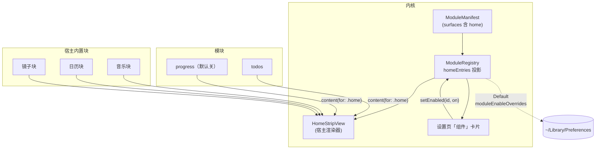
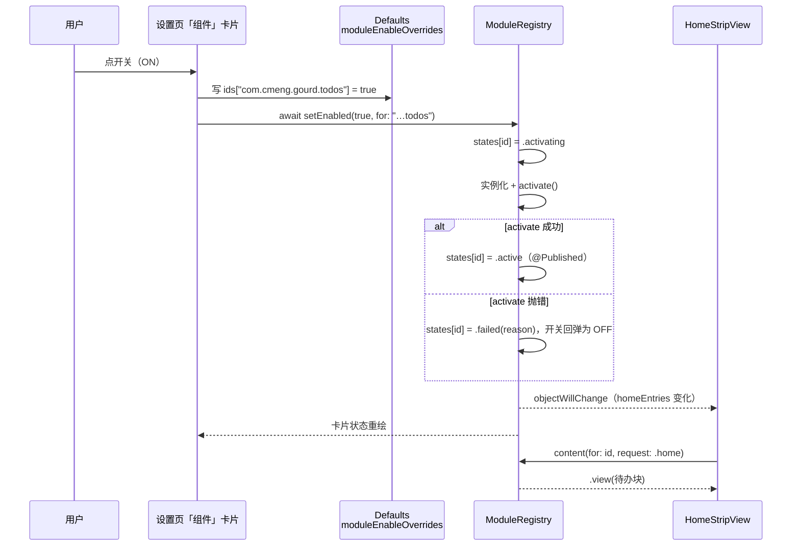
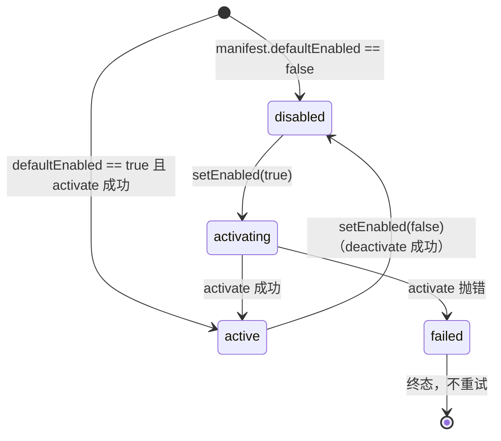

# Nook X 借鉴项落地方案（第一批：首页 strip + 组件开关闭环）

| 项 | 值 |
|---|---|
| 状态 | 草稿 |
| 设计分级 | **档 2 · 标准**（改动落在内核协议 + 首页 + 设置页三处，含新增接口与新增持久化键；不改外部契约、无数据迁移） |
| 最后更新 | 2026-09-29 |
| 关联来源 | [16-nookx-reference.md](16-nookx-reference.md) §4.2 A 组、§5（首页专节）；[13-runtime-kernel.md](13-runtime-kernel.md)（模块内核现状与已知限制）；[14-module-manifests.md](14-module-manifests.md)（17 份 manifest 清单）；[06-module-protocol.md](06-module-protocol.md)（字段级契约） |
| 讨论入口 | 本仓库会话（无 issue 跟踪）；决策记录见本文 §决策摘要 |
| 读者与分界 | §背景与目标 / §明确不做 / §备选与取舍 给人读（判方向与边界）；§接口与数据形状 / §改动点设计 是**给执行者与模型的契约**，精确到不用再做设计决策；§已知限制 / §实际交付 给后来人 |
| 本文件同时作为工作流 `p2-home-strip`（2026-09-29）的设计记录 | |

> **怎么读**：这场改动的判断依据是 §背景与目标、§明确不做、§备选与取舍；
> §接口与数据形状 与 §改动点设计 是参考型小节（执行者查考），人审可跳过；
> §已知限制、§实际交付、§决策摘要 是留给半年后的人。

---

## 一句话方案

把展开面板首页从"音乐 + 日历两栏写死"改成**一条横向 strip**：块由**模块 manifest 声明的新 surface `home`** 与宿主内置块（音乐 / 日历 / 镜子）共同提供，宽度按内容自适应且**富余时不拉伸**；同时在设置页新增「组件」卡片页，让"开关某个组件 → 首页立刻重新拼装"成为用户可见的操作。

---

## 背景与目标

### 现状（可核实）

用户原话：**"考虑首页上只有音乐和日历两项内容吗"**——这不是猜测，是本方案要解决的每个问题的出处。

现在首页的构成是硬编码的：`DynamicIsland/components/Notch/NotchHomeView.swift:863-888` 里一个 `HStack` 固定放 `MusicPlayerView` / `CalendarView`（或 `StandaloneCalendarView`）/ `CameraPreviewView`，块的存在与否只由 `showStandardMediaControls`、`showCalendar`、`showMirror` 三个上游 `Defaults` 键决定。**不改会怎样**：模块系统（P1 批次已落地 3 个模块 + 内核）在用户那里只以"折叠态中央槽位的一个数字"和"展开区多一个 tab"两种形态露面，"组件"这层概念对用户不可见；首页能承载的信息量被写死在两块上，凡是新增能力（待办、通知、计时）都只能再挤一个 tab 或再写一个硬编码块。

### 为什么是现在

两条前置条件在 2026-09-28/29 刚好齐了：① 首页日历刚改成竖向紧凑多行（`b032390a`），**首页"只有两块"的问题因此暴露得更清楚**；② 模块 manifest 已有 17 份、其中 `todos` / `progress` / `notifications` 三个模块已落地，具备"上首页"的内容供给。调研侧同期产出 [16-nookx-reference.md](16-nookx-reference.md)，其 §5 读图得到的关键事实是：Nook X 首页**不是"音乐 + 日历"，而是一条横向密排的 6–8 块 strip，块的数量由设置页里带 ON/OFF 的组件卡决定**。

### 承接关系

本文承接 `docs/16-nookx-reference.md` §4.2 A 组（"值得参考"6 项）与 §5（首页专节），继承它的三条结论：① 首页应是"已开启组件的横向拼装"；② 每块宽度按内容自适应、非等分网格；③ 不用多行滚动承载信息，焦点位用大字号、辅助信息用小字号 chip。

本文是**本次增量**，不是那份文档的替代：A 组的 6 项里本批只做 1、3、6 三项的可落地部分（见 §明确不做），其余留在源文档里按批次推进。

### 目标与可衡量指标

| 目标项 | 描述（做成后谁看到什么不同） | 可衡量指标 |
|---|---|---|
| 首页可并列多块 | 用户开启待办后，首页同时并列"音乐 / 日历 / 待办"三块，横向排列而非上下堆叠 | 首页块数 = 已开启块数（≥2 时走 strip）；单测覆盖布局纯函数 |
| 富余不拉伸 | 块在宽面板下保持内容宽度，不再被拉变形（延续用户"不能强硬拉伸"的要求） | 每块分配宽度 ≤ 其声明理想宽度；单测断言 |
| 开关即生效 | 设置页关掉某组件，首页该块立刻消失、展开 tab 同步消失，无需重启 | 单测覆盖状态迁移；目视确认一次 |
| 不新增权限面 | 首页与组件开关不引入任何新的 TCC 授权、网络请求或外部进程 | `grep` 审计新增代码无网络 / 权限 API；运行期无新日志子系统 |

关键约束：① 不得破坏上游既有的 minimalistic UI 路径与歌词侧栏路径（`enableLyrics && !showCalendar` 时首页走侧栏布局）；② 不得改动 06 号文档已定的三个 surface 取值的语义；③ 首页仍是展开面板的第一个 tab，不做"首页即全部"的改造。

---

## 做法



> 从这张图该读出什么：**首页块的名单只有一个权威源**（注册表的 `homeEntries` 投影），设置页与首页渲染器读同一份；模块只提供"块里画什么"，不决定自己在首页的位置或宽度。

**机制一 · 首页块是一种 surface。** 模块通过 manifest 的 `surfaces` 声明 `home` 表示"我可以在首页占一块"，与 `compact`（折叠态槽位）、`expanded`（展开 tab）并列。宿主因此不需要认识任何具体模块，只按 `surfaces` 投影出块名单。

**机制二 · 谁是块由三件事共同决定。** 一个块出现在首页，当且仅当：模块已注册且 `state == .active`、manifest 的 `surfaces` 含 `home`、且用户开关为开（`moduleEnableOverrides` 有键取键值，无键取 manifest 的 `defaultEnabled`）。宿主内置块（音乐 / 日历 / 镜子）不在此列，它们仍由上游 `Defaults` 键（`showStandardMediaControls` / `showCalendar` / `showMirror`）门控——本批不把接管模块提前模块化（依据 [14](14-module-manifests.md) T-3：接管模块的 config 一律映射上游既有键，不新造）。

**机制三 · 宽度由测量决定，不由声明决定。** strip 用一个 SwiftUI `Layout` 实现：先按各块的"理想宽度"求和，与可用宽度比较——**不足**时按"最小宽度 → 按缺口的比例压缩"收敛，**富余**时各块保持理想宽度、余量留在尾部（绝不拉伸）。理想宽度默认由 `Layout` 向子视图测量（`sizeThatFits(.unspecified)`）得到，块也可以用 `.layoutValue(key: HomeBlockWidthKey.self, …)` 显式声明最小 / 理想宽度，用于测量不可靠的块（如含 `ScrollView`、`GeometryReader` 的块）。

**机制四 · 组件开关是运行期状态迁移。** 注册表新增"单个模块的启用 / 停用"入口：置开时按 `bootstrap()` 的同一条路径实例化并 `activate()`，置关时 `deactivate()` 并摘除实例。设置页的卡片直接调它，注册表的 `@Published` 投影变化驱动首页与 tab 列表重绘——这就是"开关即上屏"的全部链路，没有第二份状态。

---

### 处理链路

以"用户在设置页打开『待办』组件"为例：



> 从这张图该读出什么：**开关的写路径有两条**（持久化与内存状态）且顺序固定——先落盘再改内存，activate 失败时状态是终态 `failed`、开关必须回弹，不允许出现"UI 显示开着但模块没跑"。

链路上每一段的落点：设置页卡片（§改动点设计 5）、`Defaults` 键（§接口与数据形状 4）、`setEnabled`（§接口与数据形状 3）、`homeEntries` / `content`（§接口与数据形状 1、2）、失败回弹（§状态机与流程）。

### 模块划分与依赖

| 单元 | 负责 | **不负责** |
|---|---|---|
| `Kernel/ModuleManifest.swift`（协议层） | `Surface.home` 取值与校验、`homeEntries` 投影的输入 | 不知道首页怎么排版、不知道块的宽度 |
| `Kernel/ModuleRegistry.swift` | 块的**名单与顺序**、单模块启用 / 停用、状态迁移 | 不渲染、不做布局、不知道用户开关存在哪（只读注入的门） |
| `Host/HomeStripView.swift`（新） | 测量与宽度分配、块与块之间的间距、空态 | 不知道模块是什么、不调用模块 API（只消费 `homeEntries` 与 `content`） |
| `Host/HomeStripLayoutMath.swift`（新，纯函数） | 宽度分配算术 | 不认识 SwiftUI、不做测量 |
| 宿主内置块（音乐 / 日历 / 镜子） | 自己在给定宽度内画什么 | 不参与"是否存在"的决策（由上游 `Defaults` 键决定） |
| `SettingsView.swift`（组件 tab） | 卡片呈现与开关交互、写入 overrides | 不直接实例化模块（一律经注册表） |
| 各模块（`todos` / `progress` / …） | 首页块里画什么（`content(for: .home)`） | 不知道自己在首页的位置、宽度、邻居 |

**依赖方向**：`HomeStripView → ModuleRegistry`（只读投影 + `content` 转发）、`SettingsView → ModuleRegistry`（写 `setEnabled`）、`ModuleRegistry → Defaults`（读启用门）。**已确认内核不反向依赖 UI**：`ModuleRegistry` 不 import 任何宿主视图，也不持有 `HomeStripView`（沿用 P1 的接缝 S1–S7 口径）。**模块之间零依赖**（06 §3.3 R4）。

**放置判据**（新代码归哪一层，按序回答）：

1. 这段逻辑能在没有 SwiftUI 的情况下被单测吗？能 → 内核或纯函数文件（`HomeStripLayoutMath` 因此独立成文件）。
2. 它认识"模块"这个概念吗？认识 → 内核；不认识、只认识"一个视图 + 一个宽度" → 宿主渲染器。
3. 它只在某个模块里有意义吗？是 → 放该模块文件，不放内核。
4. 它决定"某块是否存在"吗？决定 → 只能是 manifest 声明 + 用户开关，不许写在视图里。

### 状态机与流程

模块的运行时状态在原 `docs/13`（06 §4 的本批子集）上新增**用户开关触发**的双向迁移；`failed` 仍是终态。



| 当前态 | 事件 | 目标态 | 说明 |
|---|---|---|---|
| `disabled` | `setEnabled(true)` | `activating` → `active` \| `failed` | 与 `bootstrap()` 同一条实例化路径；抛错即 `failed` |
| `active` | `setEnabled(false)` | `disabled` | 先 `deactivate()` 再摘实例；`deactivate()` 抛错不改变结果（记录日志） |
| `failed` | `setEnabled(true)` | `failed`（不变） | **不重试**（06 §3.3 硬性规则 1）；UI 据此显示"该组件启动失败"并禁用开关 |
| 任意 | `setEnabled(同现值)` | 不变 | **幂等**：不重复实例化、不重复 `activate` |
| `activating` | `setEnabled(false)` | `disabled` | 上一次 `activate()` 的收尾仍会执行，但结果不写回状态（比对代数） |

**并发与幂等**：`setEnabled` 是 `@MainActor` 的 `async` 方法；同一模块的并发调用按调用顺序串行执行（主 actor 保证），后一次调用以最后一次显式意图为准；重复请求（如卡片被连点）不产生第二次 `activate()`——实现以 `states[id]` 现值做前置判定，而非依赖 UI 节流。注册表的单例性保证同一时刻只有一个 `activating` 序列。

### 横切关注点

| 关注点 | 结论 |
|---|---|
| 性能 | strip 布局在每次展开时做一次测量（块数 ≤ 6，测量是 O(块数)）；不做逐帧重排——`Layout` 的 `sizeThatFits` 只在提案变化时被调用。模块 `content(for:)` 每次请求转发一次，不缓存（沿用 `ModuleHostView` 口径）；低电模式不做特殊处理（本批无定时器驱动的块） |
| 可观测性 | `setEnabled` 记录一条 `os.Logger`（subsystem `com.cmeng.gourd.kernel`，category `registry`）：模块 id + 新旧状态 + 来源（设置页）。失败路径沿用既有 `failed` 日志。**不新增指标 / 告警**（本地单机应用，无采集面） |
| 安全 | **无（理由）**：本批不新增外部输入、不新增权限、不新增网络与文件访问；组件开关只改本机 `~/Library/Preferences` 里一个字典键。首页块渲染的是模块在进程内给出的视图，与现状同一边界 |
| 成本 | 无（本机应用，无云资源计量） |

### 兼容迁移与回滚

**兼容矩阵**（增量改动，逐条说明既有行为是否变化）：

| 维度 | 既有行为 | 本批之后 |
|---|---|---|
| 首页（标准路径） | 音乐 + 日历两栏 `HStack` | 改为横向 strip；**两款上游键仍各自门控自己的块**（关掉音乐只剩其它块） |
| 首页（minimalistic UI） | 迷你播放器单块 | **不变**（本批不动该路径） |
| 首页（歌词侧栏 `enableLyrics && !showCalendar`） | 播放器 + 侧栏歌词 + 镜子 | **不变**（本批不动该路径） |
| 展开 tab 列表 | `ModuleRegistry.tabEntries` 投影 | **不变**；用户关掉某模块时该 tab 同步消失（这是新开关的必然结果，不是回归） |
| 折叠态中央槽位 | `compactEntries` 投影 | **不变** |
| 拖动调宽高 / 高度上限 | 已落地 | **不变**；strip 在任意宽度下按同一条分配规则收敛 |
| 上游设置页（21 个 tab） | 存在 | **不变**；新增第 22 个 tab「组件」 |

**旧数据语义**：新键 `moduleEnableOverrides` 缺键 = **"用户未表达过"**，不是 false——判定回落到 manifest 的 `defaultEnabled`。因此既有用户的首次升级行为与升级前完全一致（`todos` 仍是开、`progress` 仍是关）。**无需数据迁移**。

**发布顺序**：单机应用，无服务端；"发布"= 本地 `sh tools/build.sh --install` 覆盖安装。顺序固定为 ① 内核（`.home` + `setEnabled`）→ ② 首页渲染器 → ③ 模块块 → ④ 设置页卡片，前一步不成立则后一步无内容可渲染。

**回滚**：

| 场景 | 触发条件 | 回滚动作 | 耗时 |
|---|---|---|---|
| strip 排版在用户屏幕上不可用（块被压得过窄 / 溢出） | 目视确认或用户反馈 | `git revert` 渲染器与接缝的两个提交，重装上一版 | <5 分钟 |
| 组件开关行为异常（关了还在跑 / 开了没内容） | 单测红或目视确认 | `revert` 设置页卡片与 `setEnabled` 提交；`moduleEnableOverrides` 键残留无副作用（无消费者时被忽略） | <5 分钟 |
| 需要临时回到"只有音乐 + 日历" | 任意 | 关掉 `todos` 组件 + 保留 `showCalendar` / `showStandardMediaControls` 为开——**不删代码即可退化到旧观感**（旧外观是 strip 在"只开两块"时的形态） | <1 分钟 |

---

## 明确不做

| 不做的事 | 为什么排除 |
|---|---|
| **折叠态左右槽位的图标网格**（docs/16 §4.2 A 组第 2 项） | 它是折叠态布局的重构，与首页 strip 无耦合；本批不碰关闭态优先级链（那正是通知上岛刚改过的地方） |
| **待办面板的"左导航 + 右看板"重构**（A 组第 4 项） | 属待办模块自身的展开态改造，与"首页有一块待办"是两件事；本批只做块 |
| **前台应用联动显示**（A 组第 5 项） | 它要在折叠态槽位与首页各加一处信息源，且需要新的"前台应用变化"事件；本批无该事件的消费者 |
| **充电接入时的瞬浮**（A 组第 6 项） | 与首页无关，属状态浮层批次；本批不引入新的浮层触发点 |
| **B 组 6 项全部**（胶囊形态 / 番茄钟统计 / AI 听写 / 日历看板 / 岛内编辑 / 健康提醒） | 见 docs/16 §4.2 B 组的逐条判断；本批不动 |
| **C 组（反面教训）** | 见 docs/16 §4.2 C 组；特别是"麦克风识别音乐"与"Free/Pro 门控"不引入 |
| **首页横向滚动 / 手势分页** | 与"不留大段留白、不用滚动承载信息"的取向相反（docs/16 §5.2 建议 3）；超宽时宁可少显示一块 |
| **把日历块压缩成 2 行信息条**（docs/16 §5.2 建议 1） | **用户明确要求过"日历的今日内容不能只是一行"**；本批保留刚交付的竖向紧凑多行（最多 5 行 + `+N`），只把它从"半屏栏"变成"strip 里的一块" |
| **接管模块（音乐 / 日历 / 镜子）模块化** | 依据 14 号文档 T-3：接管模块的 config 一律映射上游既有 `enable*` 键；提前模块化会产生"上游设置页改了、模块配置没跟"的双份真源 |
| **模块自报高度 / 尺寸协商** | 沿用 docs/13 的已有结论（属 P2 余项）；本批的 `ContentRequest.sizeHint` 只传分配到的宽度 |
| **锁屏 surface** | ADR-0011 第 5 条、14 号文档 T-5：锁屏维持现状 |

---

## 备选与取舍

### 备选 1 · 首页块的来源（选定：新 surface `home`）

| 方案 | 内容 | 不选的理由 |
|---|---|---|
| **A（选定）新增 surface `home`** | manifest 声明 `home`，宿主按 `surfaces` 投影块名单 | —（成本：06 号文档 §6.1 词表 +1 行；`Surface` 枚举 +1 值；校验规则不变，仍是"非空子集"） |
| B 复用 `expanded` + 请求里加 region 参数 | 不增词表，靠 `ContentRequest` 区分"tab 内容"与"首页块" | 同一个 surface 下有两个语义，模块作者无法从 manifest 看出"我会出现在首页"；而设置页要展示"将出现在：折叠态 / 展开面板 / 首页"，语义必须能声明 |
| C 宿主硬编码块表 | 首页块全部由宿主定义（含待办、通知） | 内核与模块白做：每加一个块都要改宿主；且与本批"设置页卡片 = manifest 渲染"的目标冲突 |

**连带项**：`.home` 一旦进词表，06 号文档的 §6.1 表、`Surface` 枚举、以及所有"遍历 surface"的代码（当前只有展示与校验）都要同步；执行者需在 `docs/06` 与 `docs/14` 各补一行。

### 备选 2 · 宽度分配（选定：Layout 测量 + 纯函数收敛）

| 方案 | 内容 | 不选的理由 |
|---|---|---|
| **A（选定）`Layout` + `HomeStripLayoutMath`** | 理想宽度靠测量，分配算术抽成纯函数单独单测 | — |
| B manifest 声明宽度档（`compact` / `wide` / `flexible`） | 块宽由声明决定，无需测量 | 又给 manifest 加字段，且"宽/窄"是排版细节，不该进模块协议；模块换了内容（如歌词加一行）就要改档位 |
| C 等分网格（`GridItem(.flexible)`） | 每块等宽 | 直接违反"非等分、按内容自适应"的目标，也会把大数字块压小、把播放块拉扁（正是用户抱怨过的拉伸观感） |

### 备选 3 · 组件开关的存放（选定：`moduleEnableOverrides` 字典 + manifest 兜底）

| 方案 | 内容 | 不选的理由 |
|---|---|---|
| **A（选定）`Key<[String: Bool]>`** | 只在用户显式动过开关时写键 | — |
| B 每个模块一个 `enable*` 布尔键 | 与上游风格一致 | 17 个模块 = 17 个键，且新增模块要改 `Constants.swift`；还要在文档里维护"哪个键对应哪个模块"的第二份真源 |
| C 只读 manifest `defaultEnabled` | 不做运行期开关 | 那首页块的数量就写死在代码里，用户无法调整——与本批目标（设置页开关 → 首页拼装）直接冲突 |

### 备选 4 · 设置页形态（选定：独立「组件」tab）

| 方案 | 内容 | 不选的理由 |
|---|---|---|
| **A（选定）新增 `SettingsTab.modules`** | 卡片 = 图标 + 名称 + 摘要 + surfaces 徽标 + 开关 | —（成本：`SettingsView.swift` 里 7 个 `switch` 要各加一行，属机械改动） |
| B 把每个模块的开关塞进它"主题对应"的现有 tab（待办→提醒、通知→HUD…） | 复用现有分组 | 用户找不到"我到底有哪些组件"的全局视图，正是 docs/16 §4.2 A1 要解决的"看不见/不知道有什么" |
| C 复用 `.extensions` tab | 少加一个 tab | 那个 tab 是**第三方扩展**的通道（B 表冻结的线协议身份），把内置组件混进去会让两类生命周期在 UI 上分不开 |

### 备选 5 · 本批是否含设置页卡片（选定：含）

用户原话是"按 strip 路线做"，本批因此**在 strip 之外多做了运行期开关与卡片页**。理由是 docs/16 §5.1 要点 5——**首页的块数由用户决定**——没有开关的 strip 只是"固定三块"，问题只解决一半。**范围外延已记入决策表（D-06 来源标 `agent`）**，用户在计划门可驳回这部分而保留 strip 本体。

---

## 实际交付

无（尚未实现——回写时补齐）。

---

## 已知限制

**起草期已知（设计上接受）**：

1. **strip 不滚动也不分页**：可用宽度压到各块最小宽度之和以下时，尾部的块会被丢弃（按 `order` 从尾往前）。这意味着在很窄的面板（如宽度拖到 400pt）上首页只能看到前 1–2 块。接受理由：滚动与分页都会让首页"需要操作才能看全"，与"扫一眼就够"的定位相反。
2. **块的最小宽度是软约定**：声明得过小会让块内容被压到不可读（如日历行的时间列被挤掉）。本批不引入"最小宽度校验"，由块自己负责。
3. **模块块不参与高度协商**：块拿到的是"整条 strip 的高度"，自己决定内部怎么排。`progress` 那种"剩余量清单"在 850pt 高度下会留白，本批不治。
4. **minimalistic UI 与歌词侧栏两条路径不接 strip**：这两条路径下首页仍是旧布局（两块 / 播放器 + 侧栏）。因此"首页 = strip"只在标准路径成立。
5. **接管模块（音乐 / 日历 / 镜子）不随组件开关走**：它们由上游 `Defaults` 键控制，因此设置页「组件」页**不显示**它们——用户会看到"组件页只有 3 张卡，但首页有 5 块"的不一致。接受理由：提前模块化会与上游设置页形成双份真源（14 号文档 T-3）。**缓解**：卡片页顶部有一行说明。
6. **`failed` 是终态**：组件启动失败后开关会回弹为关，用户再次打开不会重试（06 §3.3 硬性规则 1）。用户要恢复只能重启应用。

**回写期补充**：无（尚未实现）。

---

## 验收标准

| 不变量 | 保证方式 | 怎么测 |
|---|---|---|
| 首页块数 ≥2 时以横向 strip 呈现，块与块不重叠、总宽不超可用宽度 | `HomeStripLayoutMath.plan` 的分配结果满足 `sum(widths) + spacing ≤ available` | 单元测试（纯函数，含不足 / 恰好 / 富余三组用例） |
| 富余宽度不拉伸：任一块分配宽度 ≤ 其理想宽度 | 纯函数在 `available > sum(ideal)` 时返回各 `ideal` | 单元测试 |
| 不足时每块 ≥ 其最小宽度（除非连最小宽度都放不下 → 丢块） | 纯函数按 `min` 下界收敛，丢弃顺序 = `order` 降序 | 单元测试（含"全部放不下"→ 返回空 / 单块） |
| 关闭组件后：首页块消失、展开 tab 消失、折叠槽位让位，三者同步 | `homeEntries` / `tabEntries` / `compactEntries` 读同一份 `states` | 单元测试（`setEnabled(false)` 后三个投影同时不含该 id） |
| 组件启动失败：状态为 `failed`、开关回弹、不崩溃 | `setEnabled` 的失败路径写 `failed` + 设置页读状态回弹 | 单元测试（注入一个 `activate()` 抛错的模块类型） |
| 重复开 / 关是幂等的：不产生第二次 `activate()` | `states[id]` 前置判定 | 单元测试（计数 `activate` 调用次数） |
| 既有行为不变：minimalistic UI、歌词侧栏、折叠槽位、拖动调宽、上游 21 个设置 tab | 这些路径的代码不在改动清单内 | 单元测试回归（现有 168 条全绿）+ 目视一次 |
| 不新增权限面与出站请求 | 新增代码只用 `SwiftUI` / `Defaults` / `os` | `grep` 审计新增文件的 import 与 API 调用；核对 [15-platform-dependencies.md](15-platform-dependencies.md) 无新增行 |

**成功度量**（与验收分开）：用户开启 3 个组件后，首页一次展开能看到三类不同信息且无需滚动；用户能从设置页说清"现在有哪些组件、哪些开着"。

---

## 接口与数据形状

> 参考型小节：执行者与机器查考。**精确到不用再做设计决策**——下面的签名是规格，实现不得改名。

### 1. 协议层：surface 取值

```swift
// DynamicIsland/Kernel/ModuleTypes.swift
public enum Surface: String, Codable, Sendable, CaseIterable {
    case compact
    case expanded
    case lockscreen
    case home          // 新增：展开面板首页的一条 strip 块
}
```

校验规则**不变**：`surfaces` 仍是非空子集，元素 ∈ 上述四个取值；`defaultPlacement` 仍只在含 `compact` 时有意义。

### 2. 注册表投影与请求

```swift
// DynamicIsland/Kernel/ModuleRegistry.swift
public struct ModuleHomeEntry: Identifiable, Equatable {
    public let id: String
    public let label: String        // 复用 label(for:) 的解析顺序
    public let symbolName: String
    public let order: Int           // defaultPlacement.order，缺省 Int.max
}

/// active 且 surfaces 含 .home，排序键 (order, id)——与 tabEntries / compactEntries 同一比较器
public var homeEntries: [ModuleHomeEntry] { get }

/// 模块提供"首页块"内容时的请求形状
extension ContentRequest {
    static let home: ContentRequest   // surface: .home, phase: .expanded,
                                      // slot: nil, sizeHint: .zero, reason: .initial,
                                      // isLowPower: false
}
```

**`ContentRequest` 复用既有字段**：不新增字段。`slot` 用既有可选值（首页无槽位语义 → nil）；`sizeHint` 传 `.zero`——**宽度不由请求传递**，块拿到的是 SwiftUI 提案宽度（见 §改动点设计 2）。模块若返回 `.none`，该块在本次渲染中不出现（宿主不画空壳）。

### 3. 运行期开关

```swift
// DynamicIsland/Kernel/ModuleRegistry.swift
/// 置开：与 bootstrap() 同一条实例化 + activate 路径；置关：deactivate 后摘除实例。
/// 幂等；failed 是终态，置开不再重试。返回迁移后的状态（供卡片回弹）。
@discardableResult
public func setEnabled(_ enabled: Bool, for id: String) async -> ModuleRuntimeState

/// 启用门（组合根注入，替换现有 `manifests[$0]?.defaultEnabled ?? false`）：
/// 键在 overrides 里取键值，否则取 manifest.defaultEnabled，否则 false
public func register(_ types: [any GourdModule.Type],
                     enabled: @escaping (String) -> Bool)
```

`register` 签名不变（门仍是注入的闭包），**变化只在组合根传什么闭包**：

```swift
// DynamicIsland/Kernel/KernelBootstrap.swift
registry.register(builtinModules, enabled: { id in
    Defaults[.moduleEnableOverrides][id] ?? (registry.manifests[id]?.defaultEnabled ?? false)
})
```

### 4. 持久化

```swift
// DynamicIsland/models/Constants.swift（// MARK: - Modules 段）
/// 组件开关的用户显式选择。**缺键 = 用户未表达**（回落到 manifest.defaultEnabled），
/// 不是 false——升级用户的首次行为必须与升级前一致。
static let moduleEnableOverrides = Key<[String: Bool]>("moduleEnableOverrides", default: [:])
```

### 5. 布局纯函数（规格）

```swift
// DynamicIsland/Host/HomeStripLayoutMath.swift（新文件；无 import SwiftUI）
public enum HomeStripLayoutMath {
    public struct Item: Equatable {
        public let min: CGFloat
        public let ideal: CGFloat
        public init(min: CGFloat, ideal: CGFloat)
    }
    public struct Plan: Equatable {
        public let widths: [CGFloat]
        public let visibleCount: Int     // 从头开始可见的块数（= widths.count）
        public let leftover: CGFloat     // 尾部余量（富余时 > 0；不足时 == 0）
    }
    /// 规则（三条，顺序固定）：
    /// 1. 富余（available ≥ sum(ideal) + spacing×(n-1)）：widths == ideal，leftover 为余量；
    /// 2. 不足但够最小宽度和：每块 min + (ideal-min) × (1 - deficit/总可压缩量)，向下取整到 0.5pt；
    /// 3. 连最小宽度和都不够：按 order 降序（尾部优先）丢弃，直到剩余块的 min 和 + spacing 放得下；
    ///    若单块也放不下，则只保留第一块并以 available 为其宽度（不为负）。
    public static func plan(items: [Item], available: CGFloat, spacing: CGFloat) -> Plan
}
```

**不变量**：`widths.count == visibleCount`；`widths.allSatisfy { $0 >= 0 }`；`sum(widths) + spacing × max(0, count-1) <= available`（第 3 条规则的兜底例外：`available` 小于单块最小宽度时按 `available` 给宽度）。

### 6. 块宽声明（SwiftUI 侧）

```swift
// DynamicIsland/Host/HomeStripView.swift
/// 块用它声明宽度约束；不声明则理想宽度由 Layout 测量（sizeThatFits(.unspecified)），
/// 最小宽度回落到 `ideal × 0.6`。
struct HomeBlockWidthKey: LayoutValueKey {
    static let defaultValue: HomeBlockWidth? = nil
    struct HomeBlockWidth: Equatable { let min: CGFloat; let ideal: CGFloat }
}
```

### 7. 改动清单（宿主侧）

| 类别 | 落点 |
|---|---|
| 新文件 | `DynamicIsland/Host/HomeStripView.swift`、`DynamicIsland/Host/HomeStripLayoutMath.swift`、`DynamicIsland/components/Settings/ModuleSettingsSection.swift`（组件卡片页视图） |
| 新测试文件 | `DynamicIslandTests/HomeStripLayoutTests.swift`、`DynamicIslandTests/ModuleToggleTests.swift`（**须在 `project.pbxproj` 的 4 处登记**：PBXFileReference / PBXBuildFile / group children / Sources phase） |
| 改 | `DynamicIsland/components/Notch/NotchHomeView.swift`（标准路径改渲染 strip）、`DynamicIsland/Kernel/ModuleTypes.swift`、`ModuleRegistry.swift`、`KernelBootstrap.swift`、`models/Constants.swift`、`components/Settings/SettingsView.swift`（新增 tab 的 7 处 `switch`）、`Modules/TodosModule.swift`（声明 `.home` + 块内容） |

### 改动点设计

| # | 改动点 | 终态 | 落点 | 关键实现约束 | 陷阱 |
|---|---|---|---|---|---|
| 1 | `NotchHomeView` 标准路径 | 走 strip；minimalistic / 歌词侧栏两条路径**逐字保留** | `NotchHomeView.swift:840-896` 的 `mainContent` | strip 只在 `!enableMinimalisticUI && !shouldShowSideLyrics` 分支出现 | 别动 `padding(8)` 与既有 `.transition`——面板展开动画依赖它；改错会让展开时内容跳一下 |
| 2 | `HomeStripView` | `Layout` 实现 + 块封装（内置块与模块块同构） | 新文件 | 用 `Layout` 的 `sizeThatFits` 测量理想宽度；对子视图一律按分配宽度给 `.frame(width:)`；块间距单一常量 | 测量含 `ScrollView` / `GeometryReader` 的视图会得到无意义值——这类块**必须**声明 `HomeBlockWidthKey` |
| 3 | 内置块（音乐 / 日历 / 镜子） | 三块封装成各自声明宽度的块视图，门控仍读上游键 | 同 2 的文件内 | 音乐块最小宽度 300、理想 420；日历块最小 200、理想 260；镜子块最小 140、理想 160（取值依据：1051pt 面板宽下三块 + 待办块（180/240）合计理想 1080 > 可用 ≈1010，走比例压缩后仍都在最小宽度之上） | 镜子块的可见性判据是 `showMirror && webcamManager.cameraAvailable`（原逻辑），别把它写成只看 `showMirror` |
| 4 | `todos` 模块 | manifest `surfaces` 加 `home`；`content(for: .home)` 返回首页块 | `Modules/TodosModule.swift` | 块内容 = 三环横排（今日 / 本周 / 所有）+ 今日清单前 N 条；宽度 < 220 时只画三环 | 复用既有 `TodoBucketing`，不要为首页块另算一套聚合 |
| 5 | 设置页「组件」 | 新 tab，卡片列表 | `SettingsView.swift`（7 处 `switch`：`group` / `title` / `systemImage` / `tint` / `detailView` / `availableTabs` / `isTabVisible`）+ 新视图文件 | 卡片读 `ModuleRegistry.shared.manifests`（全量，含未启用）而不是 `tabEntries`（只有已激活）；开关读 `states` | `SettingsView` 是 `@ObservedObject` 还是 `@StateObject` 决定重绘——卡片视图须自己 `@ObservedObject private var registry = ModuleRegistry.shared` |
| 6 | `setEnabled` | 见 §接口与数据形状 3 | `ModuleRegistry.swift` | 复用 `bootstrap()` 里的实例化 + context 构造（**抽出私有方法**，两条路径共用）；置关走 `deactivate()` + 摘实例 | `activating` 期间被置关时，`activate()` 的收尾不得把 `states[id]` 写回 `active`——用代数（generation）比对 |
| 7 | 组合根 | 门读 `moduleEnableOverrides` | `KernelBootstrap.swift:40` | 保持一行闭包 | 注册表是单例，测试里要 `deactivateAll()` 隔离；`Defaults` 键在测试中要清理（避免污染真实偏好） |

---

## 决策摘要

| ID | 决策 | 来源 | 理由 |
|----|------|------|------|
| D-01 | 首页块来源 = 模块 manifest 新增 surface `home` + 宿主内置块（音乐 / 日历 / 镜子），两类同构渲染 | 用户 | 用户"按 strip 路线做"；manifest 驱动的块名单是 docs/16 §5.1 要点 5 的结构性设计，备选 1 的 B/C 两条都被否决 |
| D-02 | 富余宽度不拉伸：块保持理想宽度、余量留尾部 | 用户 | 用户原话"不能强硬拉伸，菜单栏里面的图标都变形了" |
| D-03 | 宽度不足时不滚动不分页：按最小宽度收敛，仍不足则按 `order` 从尾部丢块 | agent | 滚动/分页要求操作才能看全，与"扫一眼就够"的定位相反；丢块比压扁更可读 |
| D-04 | 块顺序沿用 `defaultPlacement.order`，不新增排序字段 | agent | 与展开 tab、折叠槽位共用同一排序键是既成事实（docs/13 已知限制 25 已明确写下该双语义），再加一个字段只会让三处排序有分歧 |
| D-05 | 运行期开关存 `Defaults[.moduleEnableOverrides]`（`[String: Bool]`），缺键回落 manifest `defaultEnabled` | agent | 缺键 = 用户未表达，保证升级用户行为不变；备选 3 的 B 会产生 17 个键与第二份真源 |
| D-06 | 本批含设置页「组件」卡片 + 运行期开关（超出"strip"字面范围） | agent | docs/16 §5.1 要点 5：首页块数由用户决定。范围外延已在 §备选与取舍 备选 5 记明，可被用户驳回 |
| D-07 | 组件页用独立 `SettingsTab.modules`，不塞进现有 tab、不复用 `.extensions` | agent | `.extensions` 是第三方扩展通道（B 表冻结的线协议身份），混入内置组件会让两类生命周期在 UI 上分不开 |
| D-08 | 折叠态槽位图标网格 / 待办面板重构 / 前台应用联动 / 充电瞬浮 四项本批不做 | agent | 与首页 strip 无耦合或需要本批没有的事件源；见 §明确不做 |
| D-09 | 日历首页块保留"竖向紧凑多行"，不采纳 docs/16 §5.2 建议 1 的 2 行 chip 方案 | 用户 | 用户明确要求"日历的今日内容不能只是一行"；本批只把日历从"半屏栏"改成"strip 里的一块" |
| D-10 | minimalistic UI 与歌词侧栏两条路径本批不动，strip 只在标准路径生效 | agent | 两条路径当前都未被用户启用（`enableMinimalisticUI = false`、`enableLyrics = false`），同一批改动里重写三条渲染路径会放大回归面 |
| D-11 | 模块块只走 `ModuleContent.view`，不做高度协商、不新增 descriptor | agent | 沿用 docs/13 的既有裁定（descriptor 属 P4、自报高度属 P2 余项）；本批的 `sizeHint` 不参与块宽决策 |
| D-12 | 不新增 capability / TCC 权限 / 出站请求 | agent | 组件开关只写本机偏好；首页块都是进程内视图，与现状同一边界 |

---

## 附录：改动索引

| 类别 | 文件 | 动作 |
|---|---|---|
| 协议 | `DynamicIsland/Kernel/ModuleTypes.swift` | 加 `Surface.home` |
| 内核 | `DynamicIsland/Kernel/ModuleRegistry.swift` | 加 `ModuleHomeEntry` / `homeEntries` / `setEnabled`；抽出实例化私有方法 |
| 内核 | `DynamicIsland/Kernel/KernelBootstrap.swift` | 启用门读 `moduleEnableOverrides` |
| 宿主 | `DynamicIsland/Host/HomeStripView.swift`（新） | strip 渲染器 + 块封装 + `HomeBlockWidthKey` |
| 宿主 | `DynamicIsland/Host/HomeStripLayoutMath.swift`（新） | 宽度分配纯函数 |
| 宿主 | `DynamicIsland/components/Notch/NotchHomeView.swift` | 标准路径改渲染 strip |
| 设置 | `DynamicIsland/components/Settings/ModuleSettingsSection.swift`（新） | 组件卡片页 |
| 设置 | `DynamicIsland/components/Settings/SettingsView.swift` | 新增 tab 的 7 处 `switch` |
| 配置 | `DynamicIsland/models/Constants.swift` | 加 `moduleEnableOverrides` |
| 模块 | `DynamicIsland/Modules/TodosModule.swift` | 声明 `.home` + 首页块内容 |
| 测试 | `DynamicIslandTests/HomeStripLayoutTests.swift`（新） | 布局纯函数 + 块投影 |
| 测试 | `DynamicIslandTests/ModuleToggleTests.swift`（新） | `setEnabled` 状态机与幂等 |
| 工程 | `DynamicIsland.xcodeproj/project.pbxproj` | 两个新测试文件的 4 处登记 |
| 文档 | `docs/06` §6.1、`docs/09` §首页、`docs/12`、`docs/13`、`docs/14` §1、`docs/16` §4.2 状态列 | 回写 |
