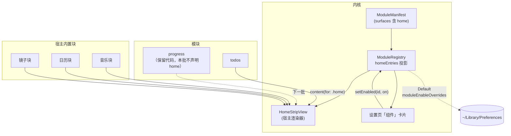
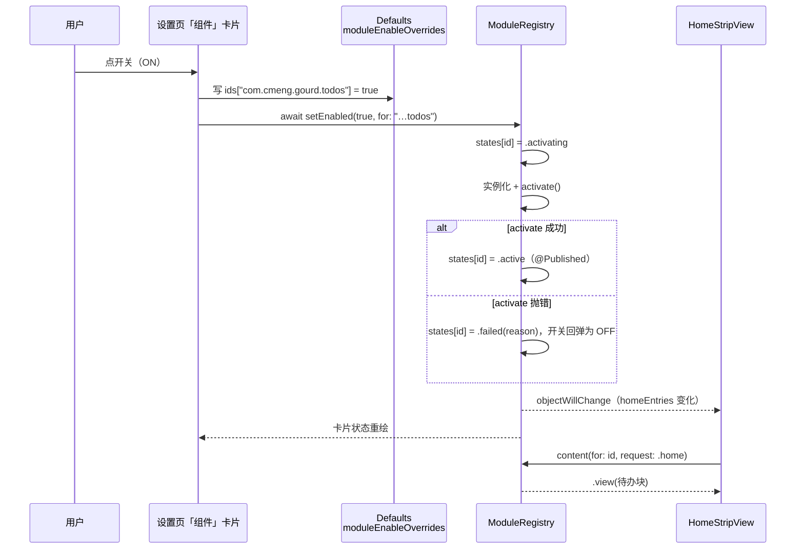
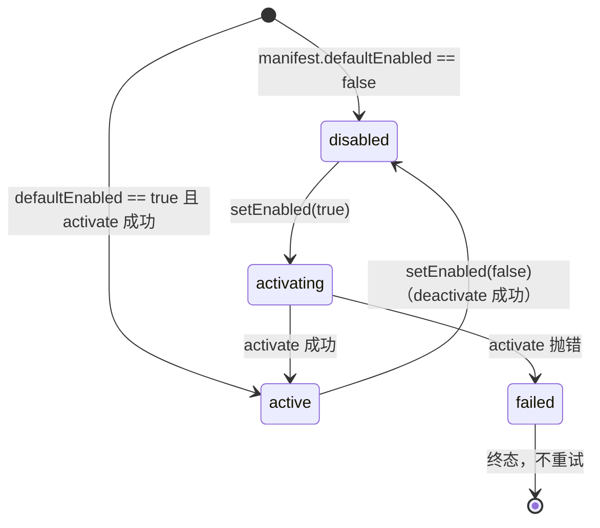

# Nook X 借鉴项落地方案（第一批：首页 strip + 组件开关闭环）

| 项 | 值 |
|---|---|
| 状态 | **已实现**（2026-09-29；用户本人的目视确认尚未取得，见 §实际交付 遗留项） |
| 设计分级 | **档 2 · 标准**（改动落在内核协议 + 首页 + 设置页三处，含新增接口与新增持久化键；不改外部契约、无数据迁移） |
| 最后更新 | 2026-09-30（`p2-honesty` 的回写：已知限制 22 就地改判——丢块提示已落地）；2026-09-29（含当晚增量批次 `p2-calendar-row` 的回写：日历改为首页单独一排 + 日期轮空条修复） |
| 关联来源 | [16-nookx-reference.md](16-nookx-reference.md) §4.2 A 组、§5（首页专节）；[13-runtime-kernel.md](13-runtime-kernel.md)（模块内核现状与已知限制）；[14-module-manifests.md](14-module-manifests.md)（17 份 manifest 清单）；[06-module-protocol.md](06-module-protocol.md)（字段级契约） |
| 讨论入口 | 本仓库会话（无 issue 跟踪）；决策记录见本文 §决策摘要 |
| 读者与分界 | §背景与目标 / §明确不做 / §备选与取舍 给人读（判方向与边界）；§接口与数据形状 / §改动点设计 是**给执行者与模型的契约**，精确到不用再做设计决策；§已知限制 / §实际交付 给后来人 |
| 本文件同时作为工作流 `p2-home-strip`（2026-09-29）的设计记录；当晚的增量批次 `p2-calendar-row`（日历改为首页单独一排 + 日期轮空条修复）也记在本文，改判就地留痕（见 §实际交付 §追加交付、§已知限制 23/24、D-25…D-27） | |

> **怎么读**：这场改动的判断依据是 §背景与目标、§明确不做、§备选与取舍；
> §接口与数据形状 与 §改动点设计 是参考型小节（执行者查考），人审可跳过；
> §已知限制、§实际交付、§决策摘要 是留给半年后的人。

---

## 一句话方案

把展开面板首页从"音乐 + 日历两栏写死"改成**一条横向 strip**：块由**模块 manifest 声明的新 surface `home`** 与宿主内置块（音乐 / 日历 / 镜子）共同提供，宽度按内容自适应且**富余时不拉伸**；同时在设置页新增「组件」卡片页，让"开关某个组件 → 首页立刻重新拼装"成为用户可见的操作。

**2026-09-29 改判（批次 `p2-calendar-row`）：首页结构由「一条横向 strip」改为「一层 strip + 一层日历行」两排。** 上排仍是 strip（块名单、宽度分配、组件开关三条机制**逐字不变**，但**日历不再是 strip 里的一块**）；下排是新增的**全宽日历行**（左整月网格可翻月 / 右所选日期的今日清单），由既有 `Defaults[.showCalendar]` 门控，关掉时整行不生成、首页回到单排 strip。理由 = 用户 2026-09-29 在三个候选（单独一排 / 与其它块同排 / 点一下展开成整排）里拍板「日历单独一排」：7 列月历需要宽度，塞进 200–260pt 的块里格子只有约 26pt。下面那句"改成一条横向 strip"仅**结构描述**作废，块机制与设置页部分不变；详见 §做法 的改判表、§已知限制 8（月历入口已解决）与 §决策摘要 D-25 / D-26 / D-27。

---

## 背景与目标

### 现状（可核实）

用户原话：**"考虑首页上只有音乐和日历两项内容吗"**——这不是猜测，是本方案要解决的每个问题的出处。

现在首页的构成是硬编码的：`DynamicIsland/components/Notch/NotchHomeView.swift:863-888` 里一个 `HStack` 固定放 `MusicPlayerView` / `CalendarView`（或 `StandaloneCalendarView`）/ `CameraPreviewView`，块的存在与否只由 `showStandardMediaControls`、`showCalendar`、`showMirror` 三个上游 `Defaults` 键决定。**不改会怎样**：模块系统（P1 批次已落地 3 个模块 + 内核）在用户那里只以"折叠态中央槽位的一个数字"和"展开区多一个 tab"两种形态露面，"组件"这层概念对用户不可见；首页能承载的信息量被写死在两块上，凡是新增能力（待办、通知、计时）都只能再挤一个 tab 或再写一个硬编码块。

### 为什么是现在

两条前置条件在 2026-09-28/29 刚好齐了：① 首页日历刚改成竖向紧凑多行（`b032390a`），**首页"只有两块"的问题因此暴露得更清楚**；② 模块 manifest 已有 17 份、其中 `todos` / `progress` / `notifications` 三个模块已落地，具备"上首页"的内容供给。调研侧同期产出 [16-nookx-reference.md](16-nookx-reference.md)，其 §5 读图得到的关键事实是：Nook X 首页**不是"音乐 + 日历"，而是一条横向密排的 6–8 块 strip，块的数量由设置页里带 ON/OFF 的组件卡决定**。

### 承接关系

本文承接 `docs/16-nookx-reference.md` §4.2 A 组（"值得参考"6 项）与 §5（首页专节），继承它的三条结论：① 首页应是"已开启组件的横向拼装"；② 每块宽度按内容自适应、非等分网格；③ 不用多行滚动承载信息，焦点位用大字号、辅助信息用小字号 chip。

本文是**本次增量**，不是那份文档的替代：A 组 6 项里本批只做**第 1 项（组件卡片化的设置页）与第 3 项（首页一条 strip）**，其余留在源文档里按批次推进（见 §明确不做）。

### 目标与可衡量指标

| 目标项 | 描述（做成后谁看到什么不同） | 可衡量指标 |
|---|---|---|
| 首页可并列多块 | 用户开启待办后，首页同时并列"音乐 / 日历 / 待办"三块，横向排列而非上下堆叠 | 首页块数 = 已开启块数（≥2 时走 strip）；单测覆盖布局纯函数 |
| 富余不拉伸 | 块在宽面板下保持内容宽度，不再被拉变形（延续用户"不能强硬拉伸"的要求） | 每块分配宽度 ≤ 其声明理想宽度；单测断言 |
| 开关即生效 | 设置页关掉某组件，首页该块立刻消失、展开 tab 同步消失，无需重启 | 单测覆盖状态迁移；目视确认一次 |
| 不新增权限面 | 首页与组件开关不引入任何新的 TCC 授权、网络请求或外部进程 | `grep` 审计新增代码无网络 / 权限 API；运行期无新日志子系统 |

关键约束：① 不得破坏上游既有的 minimalistic UI 路径与歌词侧栏路径（`enableLyrics && !showCalendar` 时首页走侧栏布局）；② 不得改动 06 号文档已定的三个 surface 取值的语义；③ 首页仍是展开面板的第一个 tab，不做"首页即全部"的改造。

---

## 做法



> 从这张图该读出什么：**首页块的名单只有一个权威源**（注册表的 `homeEntries` 投影），设置页与首页渲染器读同一份；模块只提供"块里画什么"，不决定自己在首页的位置或宽度。

**2026-09-29 改判（批次 `p2-calendar-row`）：本节的首页结构由「一条横向 strip」改为「一层 strip + 一层日历行」。** 上面那张图里 `日历块 → STRIP` 这条边自本批起**不再成立**（图与图注保留作原文记录）；机制一至机制四、处理链路、模块划分与状态机**逐字不变**——改的只有"日历在哪一排"这一件结构事实。改判后的终态：

| 项 | 改判前（p2-home-strip 交付时的写法） | 改判后（2026-09-29 晚起） |
|---|---|---|
| 首页结构 | 一条横向 strip 承载全部块，日历是其中一块（**自建日历块**：一行日期头 + hover 展开的 `WheelPicker` 日期轮 + `EventListView`） | **两排**：上排 strip + 下排**全宽日历行** `HomeCalendarRow`（左整月网格 / 右所选日期的今日清单）。接缝在 `NotchHomeView.standardHomeContent`：`VStack(spacing: 8) { strip（高度够时）; if showCalendar { HomeCalendarRow() } }` |
| strip 里的内置块 | 音乐 / **日历** / 镜子 | 音乐 / 镜子（**日历移出 strip**；块宽声明随之从 strip 消失，`grep HomeStripCalendarBlock` 全仓 0 命中） |
| 日历的承载 | 200–260pt 的块（只能"日期头 + 几点内容"，7 列格子约 26pt） | 全宽一排（左栏行宽 55%、最小 320pt），**整月一屏可见**（含最坏 6 周月份） |
| 日历的显隐 | `showCalendar` 决定 strip 里那个块的生成 | `showCalendar` 决定**整行**是否生成（关掉时首页回到单排 strip，不留空壳、不占高度） |
| 日历行的行高 | —（原为块，无独立行高） | **固定档** `HomeCalendarRow.rowHeight = 294`：公式 `rowHeight ≥ 36 × 周数 + 78`（一周 = 日格 30 + `LazyVGrid` 行距 6；3 周 186 / 5 周 258 / 6 周 294）。取 294 是为了**最坏 6 周月份也一屏显示整月**、不靠行内滚动；行高是常量、不参与高度协商 |
| strip 那一排在高度不足时 | 一直画（只在"恰好 0 高"时拦住） | **整体不画**：判据 `stripHeight >= HomeStripView.minimumUsableHeight`（= **152pt**，按"能完整渲染的下限"实测定的：封面下沿 18 + 133 = 151.5 → 取整 152）。宁可少画一条，不画残片 |
| 月历网格 | `StandaloneCalendarView` 左栏（它在展开面板里没有调用点，D-14 的能力收缩） | **抽取复用**为 `MonthGridView` + 纯函数 `MonthGridLayout.days(forMonth:calendar:)`（D-26）；`StandaloneCalendarView` 改为调用它（**行为不变**），首页日历行左侧直接用它。**`StandaloneCalendarView` 未被删除**，仍只有类型定义与注释引用 |
| 翻月与选中日 | —（原为块，无翻月） | 两套口径**有意不同**：独立面板 `monthNavigationMovesSelection: true`（翻月把选中日挪到新月份，既有行为）；**首页日历行 `false`**（翻月只改显示月份，选中日只由点某天改）——别当成漂移改回去（§已知限制 24） |

> 与改判相关的两条实现约束（本批新增，写在 §已知限制 23/24）：① 日期轮那类 AppKit 背书 `ScrollView` 的紧邻容器**不能挂 `.clipped()`**（零尺寸时被缓存成"全裁掉"，之后尺寸变大不刷新）；② 首页日历行与独立面板的翻月口径不同是刻意的。

**机制一 · 首页块是一种 surface。** 模块通过 manifest 的 `surfaces` 声明 `home` 表示"我可以在首页占一块"，与 `compact`（折叠态槽位）、`expanded`（展开 tab）并列。宿主因此不需要认识任何具体模块，只按 `surfaces` 投影出块名单。

**机制二 · 谁是块由三件事共同决定。** 一个块出现在首页，当且仅当：模块已注册且 `state == .active`、manifest 的 `surfaces` 含 `home`、且用户开关为开（`moduleEnableOverrides` 有键取键值，无键取 manifest 的 `defaultEnabled`）。宿主内置块（音乐 / 日历 / 镜子）不在此列，它们仍由上游 `Defaults` 键（`showStandardMediaControls` / `showCalendar` / `showMirror`）门控——本批不把接管模块提前模块化（依据 [14](14-module-manifests.md) T-3：接管模块的 config 一律映射上游既有键，不新造）。

**机制三 · 宽度由"声明 + 收敛"决定。** strip 用一个 SwiftUI `Layout` 实现：先按各块的"理想宽度"求和，与可用宽度比较——**不足**时按"最小宽度 → 按缺口的比例压缩"收敛，**富余**时各块保持理想宽度、余量留在尾部（绝不拉伸）。本批**所有块都显式声明宽度**（`.layoutValue(key: HomeBlockWidthKey.self, …)`）：内置三块各自声明，模块块由宿主统一声明 `180 / 240`。测量（`sizeThatFits(.unspecified)`）只作未声明块的回退——含 `GeometryReader` 的视图在测量下只报约 10pt，靠它会算出约 6pt 的块。

**机制四 · 组件开关是运行期状态迁移。** 注册表新增"单个模块的启用 / 停用"入口：置开时按 `bootstrap()` 的同一条路径实例化并 `activate()`，置关时 `deactivate()` 并摘除实例。设置页的卡片直接调它，注册表的 `@Published` 投影变化驱动首页与 tab 列表重绘——这就是"开关即上屏"的全部链路，没有第二份状态。

---

### 处理链路

以"用户在设置页打开『待办』组件"为例：



> 从这张图该读出什么：**开关的写路径有两条**（持久化与内存状态）且顺序固定——先落盘再改内存，activate 失败时状态是终态 `failed`、开关必须回弹，不允许出现"UI 显示开着但模块没跑"。

链路上每一段的落点：设置页卡片（§改动点设计 5）、`Defaults` 键（§接口与数据形状 4）、`setEnabled`（§接口与数据形状 3）、`homeEntries` / `content`（§接口与数据形状 1、2）、失败回弹（§状态机与流程）。

### 模块划分与依赖

| 单元 | 负责 | **不负责** |
|---|---|---|
| `Kernel/ModuleManifest.swift`（协议层） | `Surface.home` 取值与校验、`homeEntries` 投影的输入 | 不知道首页怎么排版、不知道块的宽度 |
| `Kernel/ModuleRegistry.swift` | 块的**名单与顺序**、单模块启用 / 停用、状态迁移 | 不渲染、不做布局、不知道用户开关存在哪（只读注入的门） |
| `Host/HomeStripView.swift`（新） | 测量与宽度分配、块与块之间的间距、空态 | 不知道模块是什么、不调用模块 API（只消费 `homeEntries` 与 `content`） |
| `Host/HomeStripLayoutMath.swift`（新，纯函数） | 宽度分配算术 | 不认识 SwiftUI、不做测量 |
| 宿主内置块（音乐 / 日历 / 镜子） | 自己在给定宽度内画什么 | 不参与"是否存在"的决策（由上游 `Defaults` 键决定） |
| `SettingsView.swift`（组件 tab） | 卡片呈现与开关交互、写入 overrides | 不直接实例化模块（一律经注册表） |
| 各模块（`todos` / `progress` / …） | 首页块里画什么（`content(for: .home)`） | 不知道自己在首页的位置、宽度、邻居 |

**依赖方向**：`HomeStripView → ModuleRegistry`（只读投影 + `content` 转发）、`SettingsView → ModuleRegistry`（写 `setEnabled`）、`ModuleRegistry → Defaults`（读启用门）。**已确认内核不反向依赖 UI**：`ModuleRegistry` 不 import 任何宿主视图，也不持有 `HomeStripView`（沿用 P1 的接缝 S1–S7 口径）。**模块之间零依赖**（06 §3.3 R4）。

**放置判据**（新代码归哪一层，按序回答）：

1. 这段逻辑能在没有 SwiftUI 的情况下被单测吗？能 → 内核或纯函数文件（`HomeStripLayoutMath` 因此独立成文件）。
2. 它认识"模块"这个概念吗？认识 → 内核；不认识、只认识"一个视图 + 一个宽度" → 宿主渲染器。
3. 它只在某个模块里有意义吗？是 → 放该模块文件，不放内核。
4. 它决定"某块是否存在"吗？决定 → 只能是 manifest 声明 + 用户开关，不许写在视图里。

### 状态机与流程

模块的运行时状态在原 `docs/13`（06 §4 的本批子集）上新增**用户开关触发**的双向迁移；`failed` 仍是终态。



| 当前态 | 事件 | 目标态 | 说明 |
|---|---|---|---|
| `disabled` | `setEnabled(true)` | `activating` → `active` \| `failed` | 与 `bootstrap()` 同一条实例化路径；抛错即 `failed` |
| `active` | `setEnabled(false)` | `disabled` | `deactivate()` 之后置 `disabled`；`deactivate()` 不抛错（协议非 throwing），失败只记日志 |
| `failed` | `setEnabled(true)` | `failed`（不变） | **不重试**（06 §3.3 硬性规则 1）；UI 据此显示"该组件启动失败"并禁用开关 |
| `failed` | `setEnabled(false)` | `failed`（不变） | **D-13：置关不把它降级成 `disabled`**——否则"置关 → 置开"会给 `failed` 开出一条隐藏的重试通道，与"要恢复只能重启"的承诺矛盾 |
| 任意 | `setEnabled(同现值)` | 不变 | **幂等**：不重复实例化、不重复 `activate` |
| `activating` | `setEnabled(false)` | `disabled` | 在飞的那次 `activate()` 收尾时**对 `instances` / `states` 一律不写**（只对自己那个悬挂实例 `deactivate()`），因此不会摘掉后来者的实例 |

**并发与幂等**：`setEnabled` 在 `@MainActor` 上，调用之间按提交顺序进入，但方法是 `async`、内含 `await` 挂起点——**挂起期间别的调用可以穿插**，因此"同一模块的并发调用串行执行"是不成立的（本条为 T2 审查实测后的更正）。实现用**全局单调代次**做相等性令牌：只有"代号仍是本 id 当前号"的那一次激活才允许写 `states` / `instances`（**置关侧也必须领一个新号**——否则在飞的那次激活会拿着仍然有效的旧号把 `.active` 写回去，"作废"静默失效），从而保证 `.activating` 期间被置关时状态不被错误写回、且后来者的实例不被抹掉。代次**不**保证 `instances` 与 `states` 永远同进同退（那是另一条不变量，本批不作承诺）。

### 横切关注点

| 关注点 | 结论 |
|---|---|
| 性能 | strip 布局在每次展开时做一次测量（块数 ≤ 6，测量是 O(块数)）；不做逐帧重排——`Layout` 的 `sizeThatFits` 只在提案变化时被调用。模块 `content(for:)` 每次请求转发一次，不缓存（沿用 `ModuleHostView` 口径）；低电模式不做特殊处理（本批无定时器驱动的块） |
| 可观测性 | `setEnabled` 记录一条 `os.Logger`（subsystem `com.cmeng.gourd.kernel`，category `registry`）：模块 id + 新旧状态 + 来源（设置页）。失败路径沿用既有 `failed` 日志。**不新增指标 / 告警**（本地单机应用，无采集面） |
| 安全 | **无（理由）**：本批不新增外部输入、不新增权限、不新增网络与文件访问；组件开关只改本机 `~/Library/Preferences` 里一个字典键。首页块渲染的是模块在进程内给出的视图，与现状同一边界 |
| 成本 | 无（本机应用，无云资源计量） |

### 兼容迁移与回滚

**兼容矩阵**（增量改动，逐条说明既有行为是否变化）：

| 维度 | 既有行为 | 本批之后 |
|---|---|---|
| 首页（标准路径） | 音乐 + 日历两栏 `HStack` | 改为横向 strip；**两款上游键仍各自门控自己的块**（关掉音乐只剩其它块）。**2026-09-29 晚 `p2-calendar-row` 改判**：该行再变为「strip 一排 + 全宽日历行」，`showCalendar` 现在门控的是**整条日历行**而不是 strip 里的一块（日历已不在 strip 内） |
| 首页（minimalistic UI） | 迷你播放器单块 | **不变**（本批不动该路径） |
| 首页（歌词侧栏 `enableLyrics && !showCalendar`） | 播放器 + 侧栏歌词 + 镜子 | **不变**（本批不动该路径） |
| 展开 tab 列表 | `ModuleRegistry.tabEntries` 投影 | **不变**；用户关掉某模块时该 tab 同步消失（这是新开关的必然结果，不是回归） |
| 折叠态中央槽位 | `compactEntries` 投影 | **不变** |
| 拖动调宽高 / 高度上限 | 已落地 | **不变**；strip 在任意宽度下按同一条分配规则收敛 |
| 上游设置页（21 个 tab） | 存在 | **不变**；新增第 22 个 tab「组件」 |

**旧数据语义**：新键 `moduleEnableOverrides` 缺键 = **"用户未表达过"**，不是 false——判定回落到 manifest 的 `defaultEnabled`。因此既有用户的首次升级行为与升级前完全一致（`todos` 仍是开、`progress` 仍是关）。**无需数据迁移**。

**发布顺序**：单机应用，无服务端；"发布"= 本地 `sh tools/build.sh --install` 覆盖安装。顺序固定为 ① 内核（`.home` + `setEnabled`）→ ② 首页渲染器 → ③ 模块块 → ④ 设置页卡片，前一步不成立则后一步无内容可渲染。

**回滚**：

| 场景 | 触发条件 | 回滚动作 | 耗时 |
|---|---|---|---|
| strip 排版在用户屏幕上不可用（块被压得过窄 / 溢出） | 目视确认或用户反馈 | `git revert` 渲染器与接缝的两个提交，重装上一版 | <5 分钟 |
| 组件开关行为异常（关了还在跑 / 开了没内容） | 单测红或目视确认 | `revert` 设置页卡片与 `setEnabled` 提交；`moduleEnableOverrides` 键残留无副作用（无消费者时被忽略） | <5 分钟 |
| 需要临时回到"只有音乐 + 日历" | 任意 | 关掉 `todos` 组件 + 保留 `showCalendar` / `showStandardMediaControls` 为开——**不删代码即可退化到旧观感**（旧外观是 strip 在"只开两块"时的形态）。**2026-09-29 晚改判后**：`showCalendar` 开的是下排的日历行、不再往 strip 里添块，所以"只有音乐"的那种单排观感只需关掉 `showCalendar` 与其它块的门控键 | <1 分钟 |

---

## 明确不做

| 不做的事 | 为什么排除 |
|---|---|
| **折叠态左右槽位的图标网格**（docs/16 §4.2 A 组第 2 项） | 它是折叠态布局的重构，与首页 strip 无耦合；本批不碰关闭态优先级链（那正是通知上岛刚改过的地方） |
| **待办面板的"左导航 + 右看板"重构**（A 组第 4 项） | 属待办模块自身的展开态改造，与"首页有一块待办"是两件事；本批只做块 |
| **前台应用联动显示**（A 组第 5 项） | 它要在折叠态槽位与首页各加一处信息源，且需要新的"前台应用变化"事件；本批无该事件的消费者 |
| **充电接入时的瞬浮**（A 组第 6 项） | 与首页无关，属状态浮层批次；本批不引入新的浮层触发点 |
| **B 组 6 项全部**（胶囊形态 / 番茄钟统计 / AI 听写 / 日历看板 / 岛内编辑 / 健康提醒） | 见 docs/16 §4.2 B 组的逐条判断；本批不动 |
| **C 组（反面教训）** | 见 docs/16 §4.2 C 组；特别是"麦克风识别音乐"与"Free/Pro 门控"不引入 |
| **首页横向滚动 / 手势分页** | 与"不留大段留白、不用滚动承载信息"的取向相反（docs/16 §5.2 建议 3）；超宽时宁可少显示一块 |
| **把日历块压缩成 2 行信息条**（docs/16 §5.2 建议 1） | **用户明确要求过"日历的今日内容不能只是一行"**；本批保留刚交付的竖向紧凑多行（最多 5 行 + `+N`），只把它从"半屏栏"变成"strip 里的一块"。**2026-09-29 晚 `p2-calendar-row` 追加改判（不改本行的结论）**：那个日历块已整体移出 strip，日历改为首页下排的**全宽日历行**（右栏仍是今日清单多行）——"不做 2 行信息条"这条判断不变，只换了载体；见 §已知限制 8 与 D-25 |
| **接管模块（音乐 / 日历 / 镜子）模块化** | 依据 14 号文档 T-3：接管模块的 config 一律映射上游既有 `enable*` 键；提前模块化会产生"上游设置页改了、模块配置没跟"的双份真源 |
| **模块自报高度 / 尺寸协商** | 沿用 docs/13 的已有结论（属 P2 余项）；本批的 `ContentRequest.sizeHint` 只传分配到的宽度 |
| **锁屏 surface** | ADR-0011 第 5 条、14 号文档 T-5：锁屏维持现状 |

---

## 备选与取舍

### 备选 1 · 首页块的来源（选定：新 surface `home`）

| 方案 | 内容 | 不选的理由 |
|---|---|---|
| **A（选定）新增 surface `home`** | manifest 声明 `home`，宿主按 `surfaces` 投影块名单 | —（成本：06 号文档 §6.1 词表 +1 行；`Surface` 枚举 +1 值；校验规则不变，仍是"非空子集"） |
| B 复用 `expanded` + 请求里加 region 参数 | 不增词表，靠 `ContentRequest` 区分"tab 内容"与"首页块" | 同一个 surface 下有两个语义，模块作者无法从 manifest 看出"我会出现在首页"；而设置页要展示"将出现在：折叠态 / 展开面板 / 首页"，语义必须能声明 |
| C 宿主硬编码块表 | 首页块全部由宿主定义（含待办、通知） | 内核与模块白做：每加一个块都要改宿主；且与本批"设置页卡片 = manifest 渲染"的目标冲突 |

**连带项**：`.home` 一旦进词表，06 号文档的 §6.1 表、`Surface` 枚举、以及所有"遍历 surface"的代码（当前只有展示与校验）都要同步；执行者需在 `docs/06` 与 `docs/14` 各补一行。

### 备选 2 · 宽度分配（选定：Layout 测量 + 纯函数收敛）

| 方案 | 内容 | 不选的理由 |
|---|---|---|
| **A（选定）`Layout` + `HomeStripLayoutMath`** | 理想宽度靠测量，分配算术抽成纯函数单独单测 | — |
| B manifest 声明宽度档（`compact` / `wide` / `flexible`） | 块宽由声明决定，无需测量 | 又给 manifest 加字段，且"宽/窄"是排版细节，不该进模块协议；模块换了内容（如歌词加一行）就要改档位 |
| C 等分网格（`GridItem(.flexible)`） | 每块等宽 | 直接违反"非等分、按内容自适应"的目标，也会把大数字块压小、把播放块拉扁（正是用户抱怨过的拉伸观感） |

### 备选 3 · 组件开关的存放（选定：`moduleEnableOverrides` 字典 + manifest 兜底）

| 方案 | 内容 | 不选的理由 |
|---|---|---|
| **A（选定）`Key<[String: Bool]>`** | 只在用户显式动过开关时写键 | — |
| B 每个模块一个 `enable*` 布尔键 | 与上游风格一致 | 17 个模块 = 17 个键，且新增模块要改 `Constants.swift`；还要在文档里维护"哪个键对应哪个模块"的第二份真源 |
| C 只读 manifest `defaultEnabled` | 不做运行期开关 | 那首页块的数量就写死在代码里，用户无法调整——与本批目标（设置页开关 → 首页拼装）直接冲突 |

### 备选 4 · 设置页形态（选定：独立「组件」tab）

| 方案 | 内容 | 不选的理由 |
|---|---|---|
| **A（选定）新增 `SettingsTab.modules`** | 卡片 = 图标 + 名称 + 摘要 + surfaces 徽标 + 开关 | —（成本：`SettingsView.swift` 里 6 处 `switch` 各加一行 + 一个手写数组加一项，属机械改动） |
| B 把每个模块的开关塞进它"主题对应"的现有 tab（待办→提醒、通知→HUD…） | 复用现有分组 | 用户找不到"我到底有哪些组件"的全局视图，正是 docs/16 §4.2 A1 要解决的"看不见/不知道有什么" |
| C 复用 `.extensions` tab | 少加一个 tab | 那个 tab 是**第三方扩展**的通道（B 表冻结的线协议身份），把内置组件混进去会让两类生命周期在 UI 上分不开 |

### 备选 5 · 本批是否含设置页卡片（选定：含）

用户原话是"按 strip 路线做"，本批因此**在 strip 之外多做了运行期开关与卡片页**。理由是 docs/16 §5.1 要点 5——**首页的块数由用户决定**——没有开关的 strip 只是"固定三块"，问题只解决一半。**范围外延已记入决策表（D-06 来源标 `agent`）**，用户在计划门可驳回这部分而保留 strip 本体。

---

## 实际交付

已交付（P2 批次 `p2-home-strip`，2026-09-29；工作流提交 `1e8c8c0c`…`dd93ef64` 加本轮回写提交）。

**代码**：`Host/HomeStripLayoutMath.swift`（新，纯几何：`Item` / `Plan` / `plan(items:available:spacing:)` 三条规则、单一口径 `leftover`）；`Host/HomeStripView.swift`（新：`HomeBlockWidth` / `HomeBlockWidthKey` / `HomeStripLayout`（`spacing = 8`、cache 复用、丢块显式零提案）/ `HomeStripBlock` / `HomeStripView`（内置块 300/420、200/260、140/160；模块块统一 180/240）/ 自建日历块（日期头 + hover 展开 `WheelPicker` 50pt + `EventListView`；**该块已于 2026-09-29 晚 `p2-calendar-row` 整体移除，见下 §追加交付**）/ 模块块降级占位）；`Kernel/ModuleTypes.swift` 加 `Surface.home`；`Kernel/ModuleRegistry.swift` 加 `ModuleHomeEntry` / `homeEntries` / `ModuleRegistry.home` / `setEnabled` / `activateIfNeeded` 抽取 + 全局单调代次；`Kernel/KernelBootstrap.swift` 加 `enablementGate(registry:)`；`models/Constants.swift` 加 `moduleEnableOverrides`；`NotchHomeView.swift` 标准分支换成 strip；`SettingsView.swift` + 新文件 `ModuleSettingsSection.swift`（第 21 个 tab「组件」）；`TodosModule.swift` 声明 `.home` 并实现首页块；`Progress/NotificationsModule` 各补一个穷尽分支。

**测试**：新增 `HomeStripLayoutTests`（16 条）与 `ModuleToggleTests`（14 条，均在 `project.pbxproj` 四处登记），`ModuleKernelTests` 增补首页块与 surfaces 断言；全量 **199 条 0 失败**（终审实跑退出码 0）。跑完 `moduleEnableOverrides` 仍缺键、偏好域 diff 仅 `ClipboardHistory`（应用自管）。

**文档**：`docs/06` §2.2/§6.1/§6.3/§7.1、`docs/09` §5.8（新增「首页 strip」）、`docs/12`（已交付批次记录 + 下一批登记）、`docs/13`（本批口径 + D-30 + 已知限制 31–35）、`docs/14`（todos 行 + 取值口径）、`docs/16` §4.2 状态表。

**与计划的偏离及原因**：① `home` 常量落在 `ModuleRegistry.home` 而不是 `extension ContentRequest`（不把宿主侧常量挂上协议层类型）；② 三个模块的 `switch request.surface` 是穷尽的，加枚举值属编译必需改动（原计划未列，已补进 §接口与数据形状 7 的改动清单）；③ `activateIfNeeded` 不做必要性守卫、跳过规则留在 `bootstrap()`（否则 `setEnabled(true)` 接不了 `.disabled`）；④ **置关侧也领新号**（否则在飞的那次激活会把 `.active` 写回去，"作废"静默失效）；⑤ T4 未改 `Localizable.xcstrings`（块内文案全部复用既有 `module.todos.*`）、未新增 `context.ui.requestRedraw()` 调用（按 `store` 的 `@Published` 重绘，与另两个模块同路）；⑥ T5 顺手补了一条 `settingsSearchIndex`、`isTabVisible` 写显式分支、新 key 用 `settings.modules.*` 前缀（同页其余 tab 以英文原文为 key）；⑦ 首页镜像块是裸 `CameraPreviewView`（旧 `cameraPreview` 的 opacity/blur 包装只服务关闭态动画，留给歌词侧栏路径）。

**遗留**：默认面板宽下首页看不到待办清单（可用 ≥864 / 面板 ≈930pt；新装默认 690pt 时待办块被规则③ 丢弃）；月历 `StandaloneCalendarView` 在展开面板无入口（本次唯一的能力收缩，补齐属 P2a 的 calendar 模块 tab）——**2026-09-29 晚 `p2-calendar-row` 已解决**：整月月历以"首页下排独立一排"的形态回到展开面板（§已知限制 8 已关闭，该条"唯一的能力收缩"的口径随之作废）；`.failed` 的卡片形态未在屏验证（无内置模块会失败），恢复路径只有"重启 + 再打开一次"；两处审查留作后续的残留风险见 §已知限制 19/20；面板宽度连续变化、非刘海外接屏、真实连点竞态未实测（§验证覆盖 已声明不验证）。

**追加交付（批次 `p2-calendar-row`，2026-09-29；工作流提交 `fd49fb00`…`2325a549` 加本轮回写提交）**：

- **新文件**：`Host/HomeCalendarRow.swift`（全宽日历行：左 `MonthGridView`（行宽 55%、最小 320pt）/ 1pt 分隔线 / 右「日期头（`collapsedHeaderHeight`）+ `EventListView`（**不滚动**，行数由 `HomeTodayListLayout.capacity` 按行高算准）」；关键常量 `rowHeight = 294`、`rowSpacing = 8`；点某天 → `selectedDate` → `CalendarManager.updateCurrentDate`；接管 `vm.isHoveringCalendar` 并在 `onDisappear` 归位）。
- **抽取复用**（本批的主要改动，不重写第二份月历）：`components/Calendar/DynamicIslandCalendar.swift` 新增纯函数 `MonthGridLayout.days(forMonth:calendar:)` 与 `struct MonthGridView`（月份标题 / ‹ › 翻月 / 星期表头 / `LazyVGrid` 日格 / 今天与选中高亮 / 按选中日居中），`StandaloneCalendarView` 删去被抽走的成员、左栏改为调用 `MonthGridView`（`monthNavigationMovesSelection: true`，**行为逐字保留**）。
- **strip**：`Host/HomeStripView.swift` 删掉 `HomeStripCalendarBlock` 整段与 `calendarBlockWidth` / `showCalendar` 成员（全仓 `HomeStripCalendarBlock` / `calendarBlockWidth` **0 命中**，无死代码）；新增并落地"画不满就不画"的守卫常量 `minimumUsableHeight = 152`。
- **接缝**：`components/Notch/NotchHomeView.swift` 标准分支改为 `standardHomeContent`——`VStack(spacing: 8) { stripHeight >= 152 时 HomeStripView; if showCalendar { HomeCalendarRow() } }`，`stripHeight = max(0, 可用高 − 294 − 8)`；minimalistic 与歌词侧栏两条路径、`.transition` / `.blur` / `.padding(8)` 逐字未动。
- **日期轮空条修复**（本批 T1）：根因 = 日期轮紧邻容器上的 `.clipped()`（见 §已知限制 23），`HomeStripView` 与 `CalendarView` 两处同构写法一并去掉那层裁剪；从 `WheelPicker` 抽出纯函数 `WheelPickerIndexMath` 并加 5 条用例。
- **测试**：`ModuleKernelTests.swift` 追加 `WheelPickerIndexMath`（5 条）、`MonthGridLayoutTests`（5 条，固定 `Calendar` + 固定月份、不依赖"今天"）、`HomeCalendarRowLayoutTests`（1 条，294 − 26 = 268 → 5 行 + `+N`）；全量 **215 条 0 失败**（本批前 204）。改动文件新增告警 0。
- **屏上验收**（截图在 `.workflow/`，随工作树消失）：`calendar-row.png`（两排 + 九月整月一屏）、`month-nav-6weeks.png`（八月 6 周一屏）、`click-day.png`（点某天 → 右栏切清单、左格高亮移动）、`next-month.png`（翻月只改显示月份）、`no-calendar-row.png`（关 `showCalendar` → 整行消失、回到单排 strip）、`strip-visible-panel544.png` / `strip-hidden-panel460.png`（strip 高度 174 ≥ 152 完整 / 90 < 152 整条不画）。

**与计划的偏离及原因**：① 行高按计划建议的 190pt 落地后一屏只 3 周（与用户"显示整月"的要求冲突），复审后改为 **294pt**（公式 `rowHeight ≥ 36N + 78`）；② 计划里的"规则③ 丢块 → 拖宽恢复"验证路径**在本机不可达**（面板最小宽 770 → strip 可用 ≈702 ≥ 三块最小宽和 + 间距 676），改测同一失效模式的**零尺寸**触发，并因此当场发现并修掉"strip 高 0 时块内容溢出画到下排日历行"（守卫与阈值 `minimumUsableHeight` 的由来）；③ strip 高度阈值由「`> 0`」改为「`>= 152`」（复审裁决"画不满就不画"——宁可少画一条，不画残片）；④ 计划未要求的分隔线（1pt `Color.white.opacity(0.08)`）为自定视觉件，已随交付落地；⑤ 日期轮的组件层未改（内部无错可修，改挂载时机会让每次展开把选中日重置回今天，见 §已知限制 23）。

---

## 已知限制

**起草期已知（设计上接受）**：

1. **strip 不滚动也不分页**：可用宽度压到各块最小宽度之和以下时，尾部的块会被丢弃（按 `order` 从尾往前）。这意味着在很窄的面板（如宽度拖到 400pt）上首页只能看到前 1–2 块。接受理由：滚动与分页都会让首页"需要操作才能看全"，与"扫一眼就够"的定位相反。
2. **块的最小宽度是软约定**：声明得过小会让块内容被压到不可读（如日历行的时间列被挤掉）。本批不引入"最小宽度校验"，由块自己负责。
3. **模块块不参与高度协商**：块拿到的是"整条 strip 的高度"，自己决定内部怎么排。`progress` 那种"剩余量清单"在 850pt 高度下会留白，本批不治。
4. **minimalistic UI 与歌词侧栏两条路径不接 strip**：这两条路径下首页仍是旧布局（两块 / 播放器 + 侧栏）。因此"首页 = strip"只在标准路径成立。
5. ~~**接管模块（音乐 / 日历 / 镜子）不随组件开关走**：它们由上游 `Defaults` 键控制，因此设置页「组件」页**不显示**它们——用户会看到"组件页只有 3 张卡，但首页最多能出现 4 块（内置 3 + 待办 1）"的不一致。接受理由：提前模块化会与上游设置页形成双份真源（14 号文档 T-3）。**缓解**：卡片页顶部有一行说明。~~
   **2026-09-30 已解决（批次 `p2-takeover`）**：音乐**成为模块**（`MusicModule`，只声明 `home`）、镜子同理（`MirrorModule`，`defaultPlacement.order 2`），两者的**启用真源就是上游那个开关键本身**（`showStandardMediaControls` / `showMirror`）——组件页有卡，卡片开关与上游设置页拨的是**同一个布尔量**，原「双份真源」的接受理由因此消失（接管 = 模块拥有渲染点 + 真源是上游键，[20](20-component-page.md) D-01）。上游键被别处（上游设置页）改动时，组合根的订阅桥（`KernelBootstrap.startTakeoverBridge`）把注册表状态拉回来，所以「上游关了、组件页还开着 / tab 还在」不会出现（毫秒级异步窗口见 [20](20-component-page.md) §已知限制 3）。**日历本批没有接管**（渲染点是首页下排那条全宽日历行，由 `NotchHomeView` 直接渲染），所以它仍不在组件卡段——但它在**「功能」段**有一张上游开关卡（`showCalendar`，纯登记），"日历的开关找不到"这个后果不成立。
6. **`failed` 是终态**：组件启动失败后开关会回弹为关，用户再次打开不会重试（06 §3.3 硬性规则 1）。用户要恢复只能重启应用。**2026-09-30 补充**：**接管模块的回弹是空操作**（不回写任何偏好）——它的偏好就是上游总开关，回弹等于「因为模块激活失败，把用户的功能关了」（`showStandardMediaControls` 还会连带关掉 Home tab 的判据），见 [20](20-component-page.md) D-13 / §已知限制 7。
7. ~~**所有模块首页块共用一份宽度声明**（`180 / 240`）：模块不能自定义自己在首页的宽度。本批不做宽度协商（D-11），模块内容（如歌词、长列表）只能在这个宽度里自适应。~~
   **2026-09-30 改判（批次 `p2-takeover`）**：`180 / 240` 收窄为「**新增**模块的宿主统一值」——**接管模块继承被接管块原本的宽度**（[20](20-component-page.md) D-10 把 D-11 的口径收窄）：音乐块 `300 / 420`、镜子块 `140 / 160` 由模块的 `homeBlockWidth` 钩子声明，宿主经 `ModuleRegistry.homeBlockWidth(for:)` 取回（`HomeStripView.blockWidth(for:)`，取不到才回落 `180 / 240`）。理由是**接管接住的是原来的呈现**，不是顺手把音乐块从 420 压到 240。**"模块不能自定义宽度"这半条仍然成立**：钩子是给接管模块继承历史值用的，新增模块依旧不参与宽度决策（要做模块自定义宽度得先有一次宽度协商的设计，本批不做）。
8. ~~**日历块保留日期选择轮，但月历没有入口**：hover 日期头展开的 `WheelPicker` 日期轮随块保留（D-14，翻日期是改动前就有的能力）；而月历 `StandaloneCalendarView` 在展开面板里**彻底没有调用点**——改前它也只在"未开音乐"时作为首页右栏出现，本批之后只剩类型定义与注释（全仓 grep 无调用点，也没有 `#Preview` 实例化它）。补齐属 `com.cmeng.gourd.calendar` 模块的 tab 落地（P2a）。**这条是本次唯一的能力收缩**，已在报告里向用户点明。~~
   **2026-09-29 已解决（批次 `p2-calendar-row`）**：本批把**整月月历放回首页、作为独立一排**——首页下排是 `HomeCalendarRow`（左 `MonthGridView` 整月网格：可翻月、今天高亮、有事件的日期带标记 / 右所选日期的今日清单多行）。**"这是本次唯一的能力收缩"这条口径随本条关闭而作废**：能力回来了，只是形态为「首页独立一排的全宽月历」，而不是「`calendar` 模块 tab 里的双栏 `StandaloneCalendarView`」。分开说清两件事：① `StandaloneCalendarView` **仍然存在、未被删除**（它的左栏被抽成 `MonthGridView` 复用，**自身行为不变**，D-26），只是继续没有调用点——"它在展开面板无入口"这句字面事实仍成立，但"用户看不到月历"这个后果已不成立；② **日期轮那半条随块一起消亡**——`WheelPicker` 日期轮原先随日历块保留，该块已整体移除，首页不再有日期轮（"翻日期"改由点月历格子完成，能力不倒退）；日期轮的空条根因本批已修（§已知限制 23），它的宿主如今只剩运行期不可达的 `CalendarView`（仅 `#Preview` 用得到）。把双栏月历做成 `calendar` 模块 tab 仍是 P2a 的**候选**，不再是能力缺口。
9. ~~**本批只有 `todos` 声明 `home`**：`progress` 代码与 manifest 保留但**不声明** `home`（默认关，声明了也没内容）；`notifications` 不做首页块（通知是瞬时事件，不是常驻信息）。~~
   **2026-09-29 改判（批次 `p2-p0-visible`）**：`notifications` **改为声明 `home`** 并实现首页块（标题「通知 · 最近 N 条」+ 最近 3 条，点条目开 App 并收起；不可读时多一行权限提示）。理由：用户原话「通知组件打开不管用」——实测管道本身是通的（投递后 HUD 浮层 400×80 真的出现），缺的是**首页可见性**：组件页开了它，首页一点变化都没有。**`progress` 仍不声明 `home`**（默认关，且卡片已标注"暂不出现在首页"）。

**回写期补充（T1，2026-09-29）**：

10. **`HomeStripLayoutMath.plan` 的浮点边界**（独立审查实测，本批四条声明全为整数故均不可达）：① `min` / `ideal` 落在非 0.5 网格时，规则② 的比例可能因浮点误差略超 1，向下取整后可产出 **-0.5pt** 的宽度（需同时 `min == 0`）；② 规则③ 的逐块递减会因残差**多丢一块**（前两块的最小宽度和恰好等于可用宽度时）；③ 前置条件里的"有限数"只覆盖 `min` / `ideal`——`available` 传 `NaN` 会得到 `widths == [0]`、传 `±∞` 不会被拦。三条都属调用方违约或非整数声明才会出现，本批不修，改为把契约写死（见 §接口与数据形状 5 的前置条件）。
11. **`leftover` 在规则③ 下可能很大**（丢块空出的空间，可达数百 pt）：它只表示"未被使用的尾部空间"，**不是"还有多少块能塞进去"**，宿主不得据此做居中或对齐。

**回写期补充（T3，2026-09-29）**：

12. **丢块必须靠"显式零提案"，不能靠"不调用 place"**：`Layout` 里没被摆放的子视图，SwiftUI 会按 Apple 文档「以容器中心 + 容器尺寸提案」自动摆放——即"少调用 `place`"会把被丢掉的块变成**叠画在已摆放块之上**。这是 strip 机制的一条硬约束，实现已在被丢弃的子视图上显式 `.zero` 提案。**但零提案还不够**：块外框不裁剪时，固定尺寸内容（三环 / 图标 / 占位三角）仍按固有尺寸溢出绘制——2026-09-29 实测 770pt 面板下第三块被规则③ 丢弃，而它的三环以"溢出残影"的形式显形（看起来"有块"，其实是残片）。因此 `HomeStripBlock` 的内容必须 `.clipped()`；两者合起来才是完整的"丢块"实现。
13. **`sizeThatFits` 与 `placeSubviews` 必须复用同一份 plan**：前者的输入是 `proposal.width`、后者的 `bounds.width` 是上一份 plan 的已压缩输出，而规则② 不幂等——两处各算一次会得到相差 ≤0.5pt/块的两组宽度。实现用 `Layout` 的 cache 存一份 plan 供两处共用。
14. **高度不协商的后果**：strip 的高度直接取 `proposal.height`；提案高为 `nil` 时整条报 0 高，日历块只剩日期头 + 一行 `+N`（不崩，但要知道这个形态存在）。**2026-09-29 晚 `p2-calendar-row` 改判**：那个"只剩日期头 + 一行"的日历块已整体移除；同一退化形态的当前落点在**接缝的守卫**——`stripHeight < HomeStripView.minimumUsableHeight`（**152**）时**整条 strip 不画**（宁可少画一条，不画残片），面板只剩日历行。
15. **日历列表的高度口径**：~~从"按 `vm.notchSize` 的**面板高度换算**"变为"**块自身实测高度**"（`GeometryReader`）。`HomeTodayListLayout.capacity` 与 `EventListView.availableHeight` 的文档串已在 T3 修复轮同步改成"两个调用方各自换算"（`CalendarView` 按面板高度 / `HomeStripCalendarBlock` 按块实测高度）。~~
    **2026-09-29 晚 `p2-calendar-row` 改判（调用方换人，口径写死成两条）**：`HomeTodayListLayout.capacity` 与 `EventListView.availableHeight` 的文档串现在写的是**两个新调用方**——`CalendarView` 按**面板高度**（`vm.notchSize` 减刘海底座与内边距、再减收起态日期头）/ `HomeCalendarRow` 按**行高常量**（`rowHeight − collapsedHeaderHeight` = 294 − 26 = **268**）。原先那句"`HomeStripCalendarBlock` 按块实测高度"随该块移除而失效（全仓已无此类型，**按高度实测那条路径也不存在**了——`HomeCalendarRow` 里的 `GeometryReader` 现在只用于左栏宽度分配，列表高度取常量）。

**回写期补充（`p2-resize-ux` + 日历行终审修复，2026-09-29 深夜）**：

25. **把手的三条已知取舍**（改动后实测）：① 横向拖动时**白点会落后光标 Δx/2**——面板是居中摆位、扩宽时右边缘只走位移一半（窗口摆位模型所致，本批未改）；② 命中框放大到 32pt（有效约 46×46）后**右下角有一块区域被它吞掉**，与本批给今日清单加的 36pt 右内边距配合避让；③ 快甩手（松手前 <100ms 才离开 hover）时那条已排程的 100ms 收起任务仍可能在松手后约 30ms 触发一次收起。
26. **月历事件标记是"按月快照"**：`CalendarManager.monthEvents` 在**翻月**时才抓一次（不是事件驱动的实时刷新），所以当月内新增/删除事件后回到该月才会更新；`events`（单日窗口）与它并存，各管一处。

**回写期补充（T4，2026-09-29）**：

16. ~~**待办块的清单有 220pt 阈值，默认面板宽下只有三环**~~
   **2026-09-29 改判（批次 `p2-p0-visible`）**：单阈值改为 **220 / 160 两档**——`>= 220` 完整行（状态圈 + 标题，最多 5 行——**没有时间列**，那是日历块 `EventListView` 的形态，待办块从来不是）、`>= 160` 紧凑行（只标题单行截断，最多 3 行）、`< 160` 只画三环。理由：本机 770pt 面板下待办块实测只分到 180.5pt，默认配置看不到清单（用户很可能因此把待办关掉了）。下面的原始数字与推导保留作核对依据：本机面板 770pt（tab 数 ≥6 时才给到这个宽度）时，胶囊内可用宽 **≈702–703pt**（常量链推导 702：ContentView 的 (19−5) + 12 与 NotchHomeView 的 8，两侧各 34；像素反推 ≈703——**两个口径都小于 704 = 三块最小宽 680 + 2×12**，这就是"间距 12 时第三块在 770pt 下被规则③ 丢弃（实拍）"的算术原因；间距改 8 后 680+16 = 696 ≤ 702，三块齐活）。代入 `plan`（理想 420/260/240、最小 300/200/180、间距 8）：705 → `[300.5, 200, 180]`、706 → `[301, 200.5, 180.5]`——两种取值下三块都压在最小宽度附近，待办块 < 220 → 只画三环。**另注意新装默认面板是 690pt**（`openNotchWidth` 默认 640 被最小宽度抬到 tab 数对应的值）→ 可用 ≈625 → 规则③ 直接丢掉待办块，首页只有音乐 + 日历两块（`[300, 200]`）。这两条都是宽度预算的必然结果，不是缺陷，但"首页看到待办清单"在默认配置下**不成立**。（数字由 T6 两轮审查与整体终审用布局常量 + 截图像素量测双路核过；早前误记的"可用 754 / 需 1000pt"已更正。）
17. **首页块的三环一律彩色**（`isSelected: true`），与展开 tab"只有当前类别彩色"不同形——首页块没有"当前类别"这个概念，故有意如此。
    **2026-10-01 改判（p5-home-blocks / D-01）：首页块不再画三环**——待办块换成「表头一行（今天 + 已办/总量 + 细进度条）+ 今日清单」，行数按块高算（`TodosHomeBlockLayout.rowCount(fittingHeight:)`，行形态按块宽分两档、门槛 160）。本条因此**只对历史成立**；`TodoScopeRing` / `TodoRingPicker` / `TodoRingLayout` 代码保留、不挂任何 surface（可逆）。详见 [29](29-home-blocks-and-panel.md) §做法 机制一。
18. **未授权提醒时首页块画三个 0/0 空环**，不做授权引导（`content(for: .home)` 恒返回 `.view`，没有"无内容"分支）。
    **2026-10-01 改判（p5-home-blocks / T1 修复轮）**：首页块**不再画空环**，未授权时**只画表头**——`store.items` 空是「读不到」而不是「今天没事」，画「今日无待办」是正面假断言（`TodosHomeBlockLayout.todayContent(todayItems:hasFullAccess:rowCount:)` 的三条判据）；块矮到一行都放不下时同样只留表头，今日**确实 0 条**且有位置时才画 `module.todos.home.empty`。授权入口仍在展开 tab（首页块没有交互面）。详见 [29](29-home-blocks-and-panel.md) §接口与数据形状 / D-19。
19. ~~**`HomeStripBlock` 没有 `.clipped()`**~~ **2026-09-29 改判（批次 `p2-p0-visible`）：已证伪"当前不触发"并已修**——770pt 面板下第三块真的会被规则③ 丢弃（可用 ≈702 < 需要 704），而被丢块未裁剪时三环会以"溢出残影"显形（看起来"有块"，其实是残片）。修法：`HomeStripBlock` 内容加 `.clipped()`，并把块间距由 12 改为 8（680+16 = 696 ≤ 702，三块才放得下）。原文如下：20. **`deactivateAll()` 的 await 窗口**：该函数在逐个 `deactivate()` 之后才清空代数表，因此在这段 await 里完成的激活仍能匹配自己的号、把实例写回 `instances`/`states`，随后被 `removeAll()` 丢掉——**那个实例不会被 `deactivate()`**。窄窗，且该函数只用于应用退出与测试隔离（进程退出时实例本就消失）。修法是把清代次提到循环之前。
22. **770pt 面板最多容三块，被丢的模块块等于"开关没效果"**：todos 与 notifications 同开时（四块：音乐 + 日历 + 两个模块块），四块最小宽和 860 + 3×8 = 884 > 可用 702 → 规则③ 丢尾部（`order` 大的那个，当前是 `order 40` 的 notifications）。此时通知组件虽然开着，首页看不到它的块。缓解：把面板拉宽到 ≈952pt，或只在组件页开一个模块块。**未做**：strip 没有"被丢了几块"的提示（`+N` 之类），属下一批的候选。**2026-09-29 晚 `p2-calendar-row` 补充**：日历块已移出 strip，本条的块集合随之变为「音乐 + 镜子 + 两个模块块」（最小宽和 800 + 3×8 = 824 > 702）——**结论方向不变**：770pt 下仍最多容三块、第四块被规则③ 丢；精确的算术以那时的实现常量为准。
    **2026-09-30 改判（批次 `p2-honesty`）：那条"未做"已落地**——丢块不再无声：条尾出现 `＋N` 小胶囊（悬停列被丢块名，用户据此知道"把面板拉宽就能看见"）。实现形态：`plan(…:tailReserve:)` 在**纯函数**里决定预留位（`Plan.droppedCount` / `tailReserveUsed`），视图与 Layout 的宽度声明同源（同一个非可选数组既喂块壳也喂 `HomeStripLayout`）。**丢块规则一字未动**（仍从尾部丢、不滚动、不压扁，D-02/D-03 不变）；预留位宽度固定 34pt、只在「基线会丢块」且「预留后仍能显示 ≥ 1 块」时生效，边界处可能因此**多丢一块**（[21](21-strip-honesty.md) §已知限制 6）。本条其余结论**不变**（770pt 下仍最多容三块、第四块被规则③ 丢——变的只是"被丢了看不见"）。设计 [21](21-strip-honesty.md)（D-01…D-08），实现提交 `8eafb8be`（T1）；`＋1` 的屏上观感尚无实机证据（[21](21-strip-honesty.md) §已知限制 12）。

**回写期补充（批次 `p2-calendar-row`，2026-09-29）**：

23. **`.clipped()` 的失效模式：零尺寸时被缓存成"全裁掉"，之后尺寸变大不刷新**（本批 T1 的根因，值得当成一条实现纪律记下来）。**症状**：那条明明是空的 / 那块看不见——内容、布局、滚动位置、绘制全都对，只是**合成不到屏幕**。**命中条件**：一个 AppKit 背书的 `ScrollView`（如 `WheelPicker` 内部的 `NSScrollView`）在容器还是**零高**时就已经挂载，而**紧邻容器**上挂着 `.clipped()`。**取证**（同屏三变体、单一变量）：A 现状（带 `.clipped()`）= 空条 / B 去掉 `.clipped()` = 正常 / C 展开才挂载（保留 `.clipped()`）= 正常；另有"应用内 `cacheDisplay` 渲染出日期、屏幕上没有"证明画得出、只是没合成。**修法**：去掉**日期轮紧邻容器**上的那层裁剪（收起态的不可见本来就由"0 高 + 透明"保证），块外壳 `HomeStripBlock` 的 `.clipped()` **保留作兜底**（它是"丢块"实现的必需件，见 §已知限制 12/19）；`CalendarView` 的同构写法一并改掉（根因不修会在恢复入口时复发）。**不取的另一条路**：改成"展开才挂载"（变体 C 有效）会把挂载时机改成每次展开新建，而 `WheelPicker.onAppear` 里 `scrollToToday` 会把 `selectedDate` 重置回今天——**每次 hover 展开都丢掉用户选的日期**，代价更大。**同族失效模式的另一面**（同一处裁剪、退化尺寸下裁不掉）：面板高度不足时 `stripHeight` 退化为 0，`HomeStripBlock` 的内容会按固有尺寸**溢出画到下排日历行上**（专辑封面压在月历格子上）；本批用接缝守卫 `stripHeight >= HomeStripView.minimumUsableHeight`（152）挡掉——**"零提案"只解决摆放，不解决绘制，"画不出来"和"画得出来但没合成"是同一个 `.clipped()` 的两面**。
24. **首页日历行的翻月口径与独立面板不同，是刻意的**：独立面板 `StandaloneCalendarView` 用 `monthNavigationMovesSelection: true`（翻月把选中日挪到新月份首日，既有行为）；**首页日历行传 `false`**（翻月只改显示月份，选中日只由点某天改——所以翻到十月时十月里没有任何高亮日、右栏仍显示原选中日的清单）。两者共用同一个 `MonthGridView`，差异**只在这一个参数**上。别把首页的口径"统一"回独立面板那套——那会让用户翻月时右栏清单莫名换天。

---

## 验收标准

| 不变量 | 保证方式 | 怎么测 |
|---|---|---|
| 首页块数 ≥2 时以横向 strip 呈现，块与块不重叠、总宽不超可用宽度 | `HomeStripLayoutMath.plan` 的分配结果满足 `sum(widths) + spacing ≤ available` | 单元测试（纯函数，含不足 / 恰好 / 富余三组用例） |
| 富余宽度不拉伸：任一块分配宽度 ≤ 其理想宽度 | 纯函数在 `available > sum(ideal)` 时返回各 `ideal` | 单元测试 |
| 不足时每块 ≥ 其最小宽度（除非连最小宽度都放不下 → 丢块） | 纯函数按 `min` 下界收敛，丢弃顺序 = `order` 降序 | 单元测试（含"全部放不下"→ 返回空 / 单块） |
| 关闭组件后：首页块消失、展开 tab 消失、折叠槽位让位，三者同步 | `homeEntries` / `tabEntries` / `compactEntries` 读同一份 `states` | 单元测试（`setEnabled(false)` 后三个投影同时不含该 id） |
| 组件启动失败：状态为 `failed`、开关回弹、不崩溃 | `setEnabled` 的失败路径写 `failed` + 设置页读状态回弹 | 单元测试（注入一个 `activate()` 抛错的模块类型） |
| 重复开 / 关是幂等的：不产生第二次 `activate()` | `states[id]` 前置判定 | 单元测试（计数 `activate` 调用次数） |
| 既有行为不变：minimalistic UI、歌词侧栏、折叠槽位、拖动调宽、上游 21 个设置 tab | 这些路径的代码不在改动清单内 | 单元测试回归（提交时 199 条全绿）+ 目视一次 |
| 不新增权限面与出站请求 | 新增代码只用 `SwiftUI` / `Defaults` / `os` | `grep` 审计新增文件的 import 与 API 调用；核对 [15-platform-dependencies.md](15-platform-dependencies.md) 无新增行 |

**成功度量**（与验收分开）：用户开启 3 个组件后，首页一次展开能看到三类不同信息且无需滚动；用户能从设置页说清"现在有哪些组件、哪些开着"。

---

## 接口与数据形状

> 参考型小节：执行者与机器查考。**精确到不用再做设计决策**——下面的签名是规格，实现不得改名。

### 1. 协议层：surface 取值

```swift
// DynamicIsland/Kernel/ModuleTypes.swift
public enum Surface: String, Codable, Sendable, CaseIterable {
    case compact
    case expanded
    case lockscreen
    case home          // 新增：展开面板首页的一条 strip 块
}
```

校验规则**不变**：`surfaces` 仍是非空子集，元素 ∈ 上述四个取值；`defaultPlacement` 仍只在含 `compact` 时有意义。

### 2. 注册表投影与请求

```swift
// DynamicIsland/Kernel/ModuleRegistry.swift
public struct ModuleHomeEntry: Identifiable, Equatable {
    public let id: String
    public let label: String        // 复用 label(for:) 的解析顺序
    public let symbolName: String
    public let order: Int           // defaultPlacement.order，缺省 Int.max
}

/// active 且 surfaces 含 .home，排序键 (order, id)——与 tabEntries / compactEntries 同一比较器
public var homeEntries: [ModuleHomeEntry] { get }

/// 模块提供"首页块"内容时的请求形状（常量挂在注册表上，与 compactSlotRequest / tabEntries 同址）
public static let home: ContentRequest   // surface: .home, phase: .expanded,
                                         // slot: nil, sizeHint: .zero, reason: .initial,
                                         // isLowPower: false
```

> **回写（2026-09-29，T1 实际实现）**：`home` 实现为 `ModuleRegistry.home` 静态常量，**不是** `extension ContentRequest` 上的成员——`ContentRequest` 是既有的协议层类型，宿主侧常量不该挂到它上面（与 `compactSlotRequest` 放在注册表内同一口径）。T3 请用 `ModuleRegistry.home`。

**`ContentRequest` 复用既有字段**：不新增字段。`slot` 用既有可选值（首页无槽位语义 → nil）；`sizeHint` 传 `.zero`——**宽度不由请求传递**，块拿到的是 SwiftUI 提案宽度（见 §改动点设计 2）。模块若返回 `.none`，该块在本次渲染中不出现（宿主不画空壳）。

### 3. 运行期开关

```swift
// DynamicIsland/Kernel/ModuleRegistry.swift
/// 置开：与 bootstrap() 同一条实例化 + activate 路径；置关：deactivate 后摘除实例。
/// 幂等；failed 是终态，置开不再重试。返回迁移后的状态（供卡片回弹）。
@discardableResult
public func setEnabled(_ enabled: Bool, for id: String) async -> ModuleRuntimeState

/// 启用门（组合根注入，替换现有 `manifests[$0]?.defaultEnabled ?? false`）：
/// 键在 overrides 里取键值，否则取 manifest.defaultEnabled，否则 false
public func register(_ types: [any GourdModule.Type],
                     enabled: @escaping (String) -> Bool)
```

`register` 签名不变（门仍是注入的闭包），**变化只在组合根传什么闭包**：

```swift
// DynamicIsland/Kernel/KernelBootstrap.swift
registry.register(builtinModules, enabled: { id in
    Defaults[.moduleEnableOverrides][id] ?? (registry.manifests[id]?.defaultEnabled ?? false)
})
```

### 4. 持久化

```swift
// DynamicIsland/models/Constants.swift（// MARK: Module Kernel (P1) 段）
/// 组件开关的用户显式选择。**缺键 = 用户未表达**（回落到 manifest.defaultEnabled），
/// 不是 false——升级用户的首次行为必须与升级前一致。
static let moduleEnableOverrides = Key<[String: Bool]>("moduleEnableOverrides", default: [:])
```

### 5. 布局纯函数（规格）

```swift
// DynamicIsland/Host/HomeStripLayoutMath.swift（新文件；无 import SwiftUI）
public enum HomeStripLayoutMath {
    public struct Item: Equatable {
        public let min: CGFloat
        public let ideal: CGFloat
        public init(min: CGFloat, ideal: CGFloat)
    }
    public struct Plan: Equatable {
        public let widths: [CGFloat]
        public let visibleCount: Int     // 从头开始可见的块数（= widths.count）
        public let leftover: CGFloat     // 未被使用的尾部空间（见下式）；≠ 0 不代表块被铺满
    }
    /// 规则（三条，顺序固定）：
    /// 1. 富余（available ≥ sum(ideal) + spacing×(n-1)）：widths == ideal；
    /// 2. 不足但够最小宽度和：每块 min + (ideal-min) × (1 - deficit/总可压缩量)，向下取整到 0.5pt；
    /// 3. 连最小宽度和都不够：按尾部（order 大的一端）优先丢弃，直到剩余块的 min 和 + spacing
    ///    放得下；若单块也放不下，则只保留第一块并以 available 为其宽度（不为负）。
    /// leftover = max(0, available - sum(widths) - spacing × max(0, visibleCount - 1))
    /// （三条规则统一口径：① 为富余量、② 为取整零头、③ 为丢块空出的空间。
    ///   **leftover 不等于 0 不代表块被铺满**，宿主不得拿它做居中/对齐依据。）
    /// 空数组：widths == []、visibleCount == 0、leftover == available。
    /// 前置条件：min / ideal / available 为有限数、0 ≤ min ≤ ideal、available ≥ 0、spacing ≥ 0；本函数不做防御。
    public static func plan(items: [Item], available: CGFloat, spacing: CGFloat) -> Plan
}
```

**不变量**：`widths.count == visibleCount`；`widths.allSatisfy { $0 >= 0 }`；`sum(widths) + spacing × max(0, count-1) <= available`（第 3 条规则的单块兜底例外同样满足该式）；`leftover` 为上面那个式子的取值（≥ 0）。

### 6. 块宽声明（SwiftUI 侧）

```swift
// DynamicIsland/Host/HomeStripView.swift
/// 块用它声明宽度约束；不声明则理想宽度由 Layout 测量（sizeThatFits(.unspecified)），
/// 最小宽度回落到 `ideal × 0.6`。
/// **两个并列的顶层类型**（`HomeBlockWidth` 不是嵌在 `HomeBlockWidthKey` 里）：
struct HomeBlockWidth: Equatable { let min: CGFloat; let ideal: CGFloat }
struct HomeBlockWidthKey: LayoutValueKey {
    static let defaultValue: HomeBlockWidth? = nil
}
```

**取值（本批固定，不得在实现时另取一套）**：音乐 `300 / 420`、日历 `200 / 260`、镜子 `140 / 160`、模块块（宿主统一）`180 / 240`。
**2026-09-29 晚 `p2-calendar-row` 改判**：日历那条 `200 / 260` **随日历块一起从 strip 移除**（`HomeStripCalendarBlock` 与 `calendarBlockWidth` 全仓 0 命中）——strip 现在只有音乐 `300 / 420`、镜子 `140 / 160`、模块块 `180 / 240` 三条取值；日历不再有块宽声明（它是下排一整行，行高 294 见 §改动点设计 8）。
**2026-09-30 `p2-takeover` 补充（取值来源变了，数值不变）**：音乐 `300 / 420` 与镜子 `140 / 160` 两条**搬到模块侧**——由接管模块的 `homeBlockWidth` 钩子（`ModuleHomeBlockWidth`）声明、宿主经 `ModuleRegistry.homeBlockWidth(for:)` 取回并映射成 `HomeBlockWidth`（`HomeStripView.blockWidth(for:)`）；`180 / 240` 仍是宿主对**新增**模块的统一声明，取不到模块声明时才用它。即：**接管模块继承被接管块原本的宽度**（[20](20-component-page.md) D-10），本条的三条数值与「接管前后同档」这个不变量都不变。
**2026-10-01 改判（p5-home-blocks / D-09 · D-10）：音乐 `300 / 420` → `240 / 300`、镜子 `140 / 160` → `140 / 140`**——音乐块降为紧凑档（宽度收窄、形态 `.compact`、封面默认关），首页上不再有「大块档」的音乐；大块档高度改由**镜子的方形边长 140** 定（`HomeFlowView.largeBlockHeight`，同时是 `MirrorModule.homeBlockWidth` 的 `min`/`ideal` 与 `HomeStripView.minimumUsableHeight`，三处编译期同源）；模块块（宿主统一）`180 / 240` 不变。**本条的旧数值只对历史成立**，「接管模块继承被接管块原本的宽度」这条语义也随之变成「派生自档高」（[29](29-home-blocks-and-panel.md) §做法 机制四 / §已知限制 9）。

### 7. 改动清单（宿主侧）

| 类别 | 落点 |
|---|---|
| 新文件 | `DynamicIsland/Host/HomeStripView.swift`、`DynamicIsland/Host/HomeStripLayoutMath.swift`、`DynamicIsland/components/Settings/ModuleSettingsSection.swift`（组件卡片页视图） |
| 新测试文件 | `DynamicIslandTests/HomeStripLayoutTests.swift`、`DynamicIslandTests/ModuleToggleTests.swift`（**须在 `project.pbxproj` 的 4 处登记**：PBXFileReference / PBXBuildFile / group children / Sources phase） |
| 改 | `DynamicIsland/components/Notch/NotchHomeView.swift`（标准路径改渲染 strip）、`DynamicIsland/Kernel/ModuleTypes.swift`、`ModuleRegistry.swift`、`KernelBootstrap.swift`、`models/Constants.swift`、`components/Settings/SettingsView.swift`（新增 tab 的六处 `switch` + `availableTabs` 数组）、`Modules/TodosModule.swift`（声明 `.home` + 块内容）、`Modules/ProgressModule.swift` 与 `Modules/NotificationsModule.swift`（**加枚举值的编译必需改动**：三处 `switch request.surface` 是穷尽的，各补一个 `case .lockscreen, .home: return .none`——语义与既有 `.none` 口径逐字一致） |
| 改（既有测试的两处断言） | `DynamicIslandTests/ModuleKernelTests.swift`：`Surface.allCases` 词表断言（加 `home` 后必红）与 todos 的 `surfaces` 断言 |

### 改动点设计

| # | 改动点 | 终态 | 落点 | 关键实现约束 | 陷阱 |
|---|---|---|---|---|---|
| 1 | `NotchHomeView` 标准路径 | 走 strip；minimalistic / 歌词侧栏两条路径**逐字保留** | `NotchHomeView.swift:840-896` 的 `mainContent` | strip 只在 `!enableMinimalisticUI && !shouldShowSideLyrics` 分支出现 | 别动 `padding(8)` 与既有 `.transition`——面板展开动画依赖它；改错会让展开时内容跳一下 |
| 2 | `HomeStripView` | `Layout` 实现 + 块封装（内置块与模块块同构） | 新文件 | `sizeThatFits` 只对**未声明宽度**的块调测量作回退；对子视图一律按分配宽度给提案；块间距单一常量 `8`（2026-09-29 由 12 改小：三块最小宽 680 + 2×12 = 704 > 770pt 面板的可用 702，改 8 后 696 ≤ 702，三块才放得下） | 含 `GeometryReader` 的视图测不出宽度（`.unspecified` 下约 10pt）——所有块**必须**声明 `HomeBlockWidthKey`，模块块由宿主统一声明 |
| 3 | 内置块（音乐 / 日历 / 镜子） | 三块封装成各自声明宽度的块视图，门控仍读上游键 | 同 2 的文件内 | 音乐 `300 / 420`、日历 `200 / 260`、镜子 `140 / 160`（取值依据：1051pt 面板宽下三块 + 待办块（180/240）合计理想 1080 > 可用 ≈1010，走比例压缩后仍都在最小宽度之上）。**日历块要自建**：`StandaloneCalendarView` 是"双栏月历 + 滚动事件面板"（顶层 `GeometryReader` 宽度对半、高度取 `vm.notchSize`、右栏是滚动 `List`），塞进 200–260pt 的块里既横滚又撑高；块内改用 `EventListView`（今日竖向紧凑多行，`DynamicIslandCalendar.swift` 内 internal 声明）+ 一行日期头 + **hover 展开的 `WheelPicker` 日期轮**（D-14），无条目时用 `EmptyEventsView`。**2026-09-29 晚 `p2-calendar-row` 改判**：本行"自建日历块"与它的 `200 / 260` 声明**已整体移除**（今天的终态见下行 8：日历是首页下排的独立一排，不再是 strip 的一块）；音乐 / 镜子两块逐字不变。**2026-09-30 `p2-takeover` 改判**：本行剩下的音乐 / 镜子两块**已搬成模块块**（`MusicModule` / `MirrorModule`），"内置块"这个概念在 strip 里**不再存在**（`HomeStripView` 里已无内置块表）；块宽继承与门控判据的当前形态见 [20](20-component-page.md) §做法 机制一 | ~~镜子块的可见性判据是 `showMirror && webcamManager.cameraAvailable && vm.notchState == .open`（原逻辑），别把它写成只看 `showMirror`~~ **2026-09-30 改判（D-12）**：镜子 / 音乐两块的门控已搬进模块，判据是 `showMirror && cameraAvailable` 与 `showStandardMediaControls && (!autoHideInactive || hasActiveSession)`——**不重复展开态**（`.home` surface 的含义就是"只在展开面板首页渲染"，旧写法里的展开态判定是内置块时代的重复，本批已删）。别把展开态加回去 |
| 4 | `todos` 模块 | manifest `surfaces` 加 `home`；`content(for: .home)` 返回首页块 | `Modules/TodosModule.swift` | ~~块内容 = 三环横排（今日 / 本周 / 所有）+ 今日清单前 N 条；宽度 < 220 时只画三环~~ **2026-10-01 改判（p5-home-blocks / D-01 · D-02）：块内容 = 表头一行（今天 + 计数 + 细进度条）+ 今日清单**，行数按**块高**算、行形态按块宽分两档（门槛 160），三环不再出现 | 复用既有 `TodoBucketing`，不要为首页块另算一套聚合（这条不变） |
| 5 | 设置页「组件」 | 新 tab，卡片列表 | `SettingsView.swift`（**六处 `switch` + 一个手写数组**：`group` / `title` / `systemImage` / `tint` / `detailView`（无 `default:`，漏改即编译错）/ `isTabVisible`（有 `default: return true`，漏改不报错）/ `availableTabs`（手写数组，漏改则 tab 静默不出现））+ 新视图文件 | 卡片读 `ModuleRegistry.shared.manifests`（全量，含未启用）而不是 `tabEntries`（只有已激活）；开关读 `states`，`nil`（已注册未判定）按关处理 | `SettingsView` 是 `@ObservedObject` 还是 `@StateObject` 决定重绘——卡片视图须自己 `@ObservedObject private var registry = ModuleRegistry.shared`；搜索索引是 `settingsSearchIndex`（`searchSuggestions` 只是过滤器，别改它） |
| 6 | `setEnabled` | 见 §接口与数据形状 3 | `ModuleRegistry.swift` | 复用 `bootstrap()` 里的实例化 + context 构造（**抽出私有方法**，两条路径共用）；`collapse` 闭包由 `bootstrap(collapse:)` 存进实例字段（初值 `{}`），`setEnabled` 不再需要该形参 | `activating` 期间被置关时，`activate()` 的收尾不得把 `states[id]` 写回 `active`——用代数（generation）比对 |
| 7 | 组合根 | 启用门抽成 `KernelBootstrap.enablementGate(registry:)`（内部可见，便于测试），内部读 `Defaults[.moduleEnableOverrides][id] ?? manifests[id]?.defaultEnabled ?? false` | `KernelBootstrap.swift:40` | 保持一行调用 | 注册表是单例，`deactivateAll()` **会连 `manifests` 一起清**，测试每个用例必须重新 `register(...)`；`Defaults` 键在测试中要清理（避免污染真实偏好） |
| 8 | `HomeCalendarRow`（**2026-09-29 晚新增的终态**，取代行 3 里那半个自建日历块） | 首页下排的**全宽日历行**：左 `MonthGridView`（行宽 55%、最小 320pt）+ 1pt `Color.white.opacity(0.08)` 分隔线 + 右「日期头 + `EventListView`（**不滚动**，行数由 `HomeTodayListLayout.capacity` 按行高算准）」；关键常量 `rowHeight = 294`、`rowSpacing = 8`（与接缝里的 `VStack(spacing:)` 同一个数） | `DynamicIsland/Host/HomeCalendarRow.swift`（新文件）+ `NotchHomeView.standardHomeContent` 接缝 | 整行由 `showCalendar` 门控（关掉**根本不生成**，不留空壳、不占高度）；翻月传 `monthNavigationMovesSelection: false`（§已知限制 24）；`stripHeight = max(0, 可用高 − 294 − 8)` 且 `>= HomeStripView.minimumUsableHeight`（152）时才画 strip（§已知限制 23 的守卫）；`vm.isHoveringCalendar` 必须在 `onDisappear` 归位（否则面板再也收不起来） | 别把日历行写成 strip 的一块——它**不参与宽度分配、不参与丢块**，也不接受 `HomeBlockWidthKey`；别动 minimalistic / 歌词侧栏两条路径；日期头与列表之间的 4pt 间距已含在 `collapsedHeaderHeight`（26）里，不再另加；`MonthGridView` 从 `StandaloneCalendarView` 左栏抽出后 `StandaloneCalendarView` 行为不得变 |

---

## 决策摘要

| ID | 决策 | 来源 | 理由 |
|----|------|------|------|
| D-01 | 首页块来源 = 模块 manifest 新增 surface `home` + 宿主内置块（音乐 / 日历 / 镜子），两类同构渲染 | 用户 | 用户"按 strip 路线做"；manifest 驱动的块名单是 docs/16 §5.1 要点 5 的结构性设计，备选 1 的 B/C 两条都被否决 |
| D-02 | 富余宽度不拉伸：块保持理想宽度、余量留尾部 | 用户 | 用户原话"不能强硬拉伸，菜单栏里面的图标都变形了" |
| D-03 | 宽度不足时不滚动不分页：按最小宽度收敛，仍不足则按 `order` 从尾部丢块 | agent | 滚动/分页要求操作才能看全，与"扫一眼就够"的定位相反；丢块比压扁更可读 |
| D-04 | 块顺序沿用 `defaultPlacement.order`，不新增排序字段 | agent | 与展开 tab、折叠槽位共用同一排序键是既成事实（docs/13 已知限制 25 已明确写下该双语义），再加一个字段只会让三处排序有分歧 |
| D-05 | 运行期开关存 `Defaults[.moduleEnableOverrides]`（`[String: Bool]`），缺键回落 manifest `defaultEnabled` | agent | 缺键 = 用户未表达，保证升级用户行为不变；备选 3 的 B 会产生 17 个键与第二份真源 |
| D-06 | 本批含设置页「组件」卡片 + 运行期开关（超出"strip"字面范围） | agent | docs/16 §5.1 要点 5：首页块数由用户决定。范围外延已在 §备选与取舍 备选 5 记明，可被用户驳回 |
| D-07 | 组件页用独立 `SettingsTab.modules`，不塞进现有 tab、不复用 `.extensions` | agent | `.extensions` 是第三方扩展通道（B 表冻结的线协议身份），混入内置组件会让两类生命周期在 UI 上分不开 |
| D-08 | 折叠态槽位图标网格 / 待办面板重构 / 前台应用联动 / 充电瞬浮 四项本批不做 | agent | 与首页 strip 无耦合或需要本批没有的事件源；见 §明确不做 |
| D-09 | 日历首页块保留"竖向紧凑多行"，不采纳 docs/16 §5.2 建议 1 的 2 行 chip 方案 | 用户 | 用户明确要求"日历的今日内容不能只是一行"；本批只把日历从"半屏栏"改成"strip 里的一块"。**2026-09-29 晚 `p2-calendar-row` 改判**：载体再变——那块已从 strip 移除，日历成为首页下排的全宽日历行（右栏仍是今日清单多行，D-25）；"不做 2 行 chip"这条判断与理由**不变** |
| D-10 | minimalistic UI 与歌词侧栏两条路径本批不动，strip 只在标准路径生效 | agent | 两条路径当前都未被用户启用（`enableMinimalisticUI = false`、`enableLyrics = false`），同一批改动里重写三条渲染路径会放大回归面 |
| D-11 | 模块块只走 `ModuleContent.view`，不做高度协商、不新增 descriptor | agent | 沿用 docs/13 的既有裁定（descriptor 属 P4、自报高度属 P2 余项）；本批的 `sizeHint` 不参与块宽决策 |
| D-12 | 不新增 capability / TCC 权限 / 出站请求 | agent | 组件开关只写本机偏好；首页块都是进程内视图，与现状同一边界 |
| D-13 | `failed` 是**不可逃逸**的终态：置关不把它改成 `.disabled`，置开不重试 | agent | 06 §3.3 硬性规则 1 与本文 §已知限制 6（"要恢复只能重启应用"）都承诺不重试；T2 审查实测"置关 → 置开"能给 failed 开出一条隐藏的重试通道，与承诺矛盾。代价：组件启动失败后本次运行内无法恢复，只能重启（这是原本就写下的口径，现在代码也守它） |
| D-14 | 日历块**保留日期选择轮**（hover 日期头展开，与改动前一致）；月历 `StandaloneCalendarView` 在展开面板无入口，补齐属 `calendar` 模块 tab（P2a） | agent | 不引入用户可见能力倒退：翻日期是改动前就有的能力，strip 重构不该静默拿掉。T3 审查实测：`NotchViews` 里没有 calendar，改前月历也只在"未开音乐"时出现。**2026-09-29 晚 `p2-calendar-row` 改判**：月历入口**已补回**（首页下排独立一排的整月网格，D-25），"无入口 / 能力收缩"的结论作废（§已知限制 8 已关闭）；日期轮随日历块移除而退出首页，"翻日期"改由点月历格子完成——能力不倒退，只是换了载体 |
| D-15 | `home` 请求常量落在 `ModuleRegistry.home`（宿主侧），不挂到协议层的 `ContentRequest` 上 | agent | `ContentRequest` 是模块协议的一部分，宿主常量挂上去会把"谁决定请求形状"搅混；与既有 `compactSlotRequest` 同址 |
| D-16 | 置关侧也领新代次号；`activateIfNeeded` 不自带必要性守卫（跳过规则留在调用方） | agent | 前者是"在飞激活被作废"机制生效的前提，后者是同时满足"`bootstrap()` 行为逐字不变"与"`setEnabled(true)` 能接 `.disabled`"的唯一落法。代价：方法名前缀 `IfNeeded` 与实现不符，靠注释与调用点守卫维持 |
| D-17 | 首页镜像块用裸 `CameraPreviewView`；模块首页块不加 `requestRedraw` 调用；组件页新 key 用 `settings.modules.*` 前缀 | agent | 那层 opacity/blur 包装只服务关闭态动画；`store` 的 `@Published` 已驱动重绘（与另两个模块同路）；前缀与本批新增 key 的形态一致 |
| D-18 | ~~`HomeStripBlock` 的 `.clipped()` 与 `deactivateAll()` 的 await 窗口本批不修~~ **2026-09-29 改判（`p2-p0-visible`）**：`.clipped()` **已修**（见 §已知限制 19 与 D-23）；`deactivateAll()` 的 await 窗口仍留作后续（§已知限制 20 不变） | agent | 原判据"当前配置不触发"被实测证伪：770pt 下第三块会被丢弃且残影可见 |
| D-19 | 通知组件**新增首页块**（「通知 · 最近 N 条」+ 最近 3 条，点条目开 App 并收起；不可读时一行权限提示） | 用户 | 用户原话「通知组件打开不管用」；实测管道通，缺的是首页可见性。**改判了 §已知限制 9**（原写"通知是瞬时事件，不做首页块"），理由与证据见该条。代价：首页多一块常驻信息，需要时可在组件页关掉 |
| D-20 | 组件卡每张加一行「效果 / 出现位置」，`progress` 另标「默认关闭」 | 用户 | 同一条抱怨的另一半：三张卡里只有待办有首页效果（现在通知也有了），卡片必须自己讲清"开它之后会看到什么"，否则用户只能靠猜 |
| D-21 | 待办块单阈值改 **220 / 160 / 0 三档**（≥220 完整行、≥160 紧凑行、<160 只画环） | agent | 本机 770pt 面板下待办块实测 180.5pt，默认配置看不到清单；分档比"让用户调面板宽"或"给每块加权重"成本低得多。代价：紧凑行只有标题（无时间列），信息更少 |
| D-22 | 首页通知块显示的是**列表条数**，与折叠态铃铛的「自上次打开面板以来的新增数」是两个口径，**不强行统一** | agent | 铃铛的 `unseenCount` 只在展开 tab 打开时清零（既有行为），统一它要动既有计数语义；改措辞让它说实话成本更低（块头从"未读 N"改成"最近 N 条"，与展开 tab 同词） |
| D-23 | 块间距由 **12 改为 8**；`HomeStripBlock` 内容加 **`.clipped()`** | agent | 实测：770pt 面板可用宽 ≈702 < 704（三块最小宽 680 + 2×12），间距 12 时第三块被规则③ 整块丢弃；而被丢块不裁剪时其固定尺寸内容会以"溢出残影"显形（看起来有块）。改 8 后 696 ≤ 702 三块齐活；裁剪让"丢块"变成真正不可见。教训：**"零提案"只解决摆放，不解决绘制** |
| D-24 | 770pt 面板**最多容三块**：todos 与 notifications 同开时，`order` 大的那个模块块会被丢弃（当前是 `order 40` 的 notifications） | agent | 四块最小宽和 860 + 3×8 = 884 > 702，需面板 ≈952pt。这是"块数由用户决定 + 面板宽度可调"的必然结果，不是缺陷；**后果**是"通知开关在该配置下仍无可见效果"，缓解是把面板拉宽或在组件页只开一个模块块。已记入 §已知限制 22 |
| D-25 | 首页 = 「**strip 一排 + 全宽日历行**」，日历**不再作为 strip 的一块**（原日历块整体移除） | 用户 | 用户 2026-09-29 在三个候选（单独一排 / 与其它块同排 / 点一下展开成整排）里拍板「日历单独一排」：7 列月历需要宽度（塞进 200–260pt 的块里格子约 26pt，只能"日期头 + 几点内容"），且顺带把月历入口补回展开面板（关闭 D-14 的能力收缩）。代价：面板高度不足时上排 strip 整体不画（阈值 152），面板只剩日历行 |
| D-26 | 整月网格**抽取复用**（`MonthGridView` + 纯函数 `MonthGridLayout.days(forMonth:calendar:)`），不写第二份月历 | agent | 那份实现已含月份标题 / 翻月 / 今天与选中高亮 / 事件标记 / 按选中日居中；重写必然与它漂移（同 `TodoHomeRow` 副本的教训，§已知限制 21）。抽取后 `StandaloneCalendarView` 改为调用它、**行为不变**（`monthNavigationMovesSelection: true`），首页日历行传 `false`（§已知限制 24） |
| D-27 | 月历**自绘**，不用系统的 `NSDatePicker(.clockAndCalendar)` | 用户 | 用户问过"直接取系统的日历显示不可以吗"，说明后选择继续自绘（2026-09-29）。事实基础：macOS 没有公开 API 把日历 App 的月视图嵌进别的 App（`EKEventViewController` 只管单个事件、`EKCalendarChooser` 只是日历选择器、WidgetKit 组件不能嵌视图）；唯一可嵌的系统控件是 `NSDatePicker(.clockAndCalendar)`，但它的配色 / 字号 / 圆角几乎不可调、不能给日期加事件标记、也接不上右侧清单联动 |
| D-28 | 月历的「有事件的日期打标记」用**独立按月数据路径**（`CalendarManager.monthEvents`），不改 `events` 的单日窗口 | agent | 复核实测：`events` 只装 `[选中日, +1d)` 的事件，用它打标记等于"只有选中日有点"（月历等于白打）；单日窗口是今日清单与旧日历面板的既有契约，不能动，故新增按月快照 |
| D-29 | 放大把手命中框后，给今日清单加 36pt 右内边距让开 | agent | 命中框 32pt（有效约 46×46）贴右下角，会盖住清单最后一行的行尾；缩回把手等于回到"很费劲"，让开更划算 |
## 附录：改动索引

> 下表是 `p2-home-strip`（2026-09-29）的改动索引。**`p2-calendar-row`（2026-09-29 晚）的增量**见 §实际交付 §追加交付：新增 `DynamicIsland/Host/HomeCalendarRow.swift`；`DynamicIsland/components/Calendar/DynamicIslandCalendar.swift` 抽出 `MonthGridLayout` + `MonthGridView`（`StandaloneCalendarView` 改调用）；`DynamicIsland/Host/HomeStripView.swift` 移除 `HomeStripCalendarBlock` 与 `calendarBlockWidth`、加 `minimumUsableHeight = 152`、日期轮容器去 `.clipped()`；`DynamicIsland/components/Notch/NotchHomeView.swift` 改成两排接缝；`DynamicIslandTests/ModuleKernelTests.swift` +11 用例（`WheelPickerIndexMath` 5 / `MonthGridLayoutTests` 5 / `HomeCalendarRowLayoutTests` 1）。

| 类别 | 文件 | 动作 |
|---|---|---|
| 协议 | `DynamicIsland/Kernel/ModuleTypes.swift` | 加 `Surface.home` |
| 内核 | `DynamicIsland/Kernel/ModuleRegistry.swift` | 加 `ModuleHomeEntry` / `homeEntries` / `setEnabled`；抽出实例化私有方法 |
| 内核 | `DynamicIsland/Kernel/KernelBootstrap.swift` | 启用门读 `moduleEnableOverrides` |
| 宿主 | `DynamicIsland/Host/HomeStripView.swift`（新） | strip 渲染器 + 块封装 + `HomeBlockWidthKey` |
| 宿主 | `DynamicIsland/Host/HomeStripLayoutMath.swift`（新） | 宽度分配纯函数 |
| 宿主 | `DynamicIsland/components/Notch/NotchHomeView.swift` | 标准路径改渲染 strip |
| 设置 | `DynamicIsland/components/Settings/ModuleSettingsSection.swift`（新） | 组件卡片页 |
| 设置 | `DynamicIsland/components/Settings/SettingsView.swift` | 新增 tab 的 7 处 `switch` |
| 配置 | `DynamicIsland/models/Constants.swift` | 加 `moduleEnableOverrides` |
| 模块 | `DynamicIsland/Modules/TodosModule.swift` | 声明 `.home` + 首页块内容 |
| 测试 | `DynamicIslandTests/HomeStripLayoutTests.swift`（新） | 布局纯函数 + 块投影 |
| 测试 | `DynamicIslandTests/ModuleToggleTests.swift`（新） | `setEnabled` 状态机与幂等 |
| 工程 | `DynamicIsland.xcodeproj/project.pbxproj` | 两个新测试文件的 4 处登记 |
| 文档 | `docs/06` §6.1、`docs/09` §首页、`docs/12`、`docs/13`、`docs/14` §1、`docs/16` §4.2 状态列 | 回写 |
