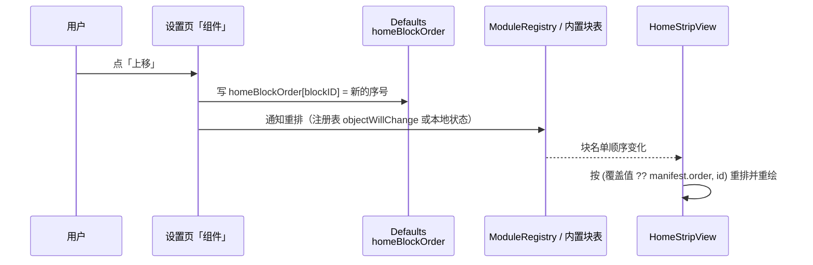

# P1 第一批：待办面板重构 + 首页块顺序可调

| 项 | 值 |
|---|---|
| 状态 | 草稿 |
| 设计分级 | **档 2 · 标准**（待办模块内部重构 + 写回系统提醒的 `priority` 字段 + 首页块排序新增一个持久化覆盖；不改对外契约） |
| 最后更新 | 2026-09-29 |
| 关联来源 | [16-nookx-reference.md](16-nookx-reference.md) §4.4（P1 第 6、7 项）；[17-nookx-adoption.md](17-nookx-adoption.md)（首页 strip / 块模型的设计记录）；[09](09-features-and-mechanisms.md) §5.8；[14](14-module-manifests.md) §1 的 todos 行 |
| 讨论入口 | 本仓库会话 |
| 读者与分界 | §背景与目标 / §明确不做 / §备选与取舍 给人读；§接口与数据形状 / §改动点设计 是**给执行者的契约**；§已知限制 / §实际交付 给后来人 |
| 本文件同时作为工作流 `p2-todos-facelift`（2026-09-29）的设计记录 | |

> **怎么读**：判断依据在 §背景与目标、§明确不做、§备选与取舍；§接口与数据形状与 §改动点设计 供执行者查考；§已知限制、§实际交付、§决策摘要 留给后来人。

---

## 一句话方案

把待办展开面板从"左侧三环竖排 + 右侧清单"升级为**左导航四视图（今天 / 最近 7 天 / 清单 / 已完成）+ 右看板（分组标题 + 计数徽标 + 行内优先级胶囊与日期）**；并让**首页块的顺序可以在设置页「组件」里调整**（覆盖 manifest 的默认 `order`）。

---

## 背景与目标

**问题现状**：① 待办展开面板现在是"三环当筛选器 + 一份清单"——环只能表达"今天 / 本周 / 所有"三个聚合量，**没有"已完成"这个视图**，也没有分组标题与计数，条目多了只能靠一条长列表；Nook X 的做法是左导航 + 右看板（[16](16-nookx-reference.md) §4.2 A 组第 4 项，本批 P1-7）。② 首页块的顺序现在**写死在 manifest 的 `defaultPlacement.order` 里**（音乐 420/日历/模块块），用户在设置页只能开关组件、不能调顺序——而"设置里开关 + 排序 → 首页拼装"正是这套组件化的完整形态（[16](16-nookx-reference.md) §4.4 P1 第 6 项）。

**为什么是现在**：首页 strip 与组件页已落地（`p2-home-strip` / `p2-p0-visible`），块的数量与可见性已经能配置，差的就是顺序；待办是目前唯一"上了首页又有展开面板"的模块，它的面板质量直接影响日常使用。

**承接关系**：本批是 [17](17-nookx-adoption.md) 的增量，不改它的结构决策（strip + 日历行、块宽、丢块规则都不动）。首页排序沿用 17 号文档 D-04 的排序键 `(order, id)`，本批只是给 `order` 加一个**用户覆盖层**。

**目标与可衡量指标**：

| 目标项 | 描述 | 可衡量指标 |
|---|---|---|
| 待办有四个视图 | 展开面板左侧能在"今天 / 最近 7 天 / 清单 / 已完成"之间切换，右侧显示对应条目 | 单元测试覆盖四个视图的取数口径；目视一次 |
| 行上有优先级与日期 | 每行显示优先级胶囊（无 / 低 / 中 / 高）与日期；点胶囊可循环修改并**写回系统提醒** | 单元测试（优先级映射 0/1/5/9 ↔ 无/高/中/低）；目视一次 |
| 首页块可排序 | 设置页「组件」里能上移/下移首页块，顺序落盘、重启保持、首页立即重排 | 单元测试（排序纯函数 + 覆盖生效）；目视一次 |

**关键约束**：不新增权限（提醒授权已有）；不改 [17](17-nookx-adoption.md) 的块宽与丢块规则；不新增模块（本批不落地 P2a 的 状态/动作类模块）。

---

## 做法

**机制一 · 四个视图共用一套取数**。现在 `TodoBucketing` 产出"今日 / 本周 / 所有"三个聚合；本批把"视图"与"聚合"解耦：视图 = `今天 / 最近 7 天 / 清单 / 已完成`，**每个视图用同一份 `store.items` 过滤**（今天 = 今天到期、最近 7 天 = 未来 7 天到期、清单 = 全部未完成、已完成 = 已完成条目），分组标题与计数由过滤后的结果算——**不新增第二套统计**（沿用 17 号文档 D-11 的口径）。

**机制二 · 优先级是 EventKit 的既有字段**。`EKReminder.priority`（0 = 无、1–4 = 高、5 = 中、6–9 = 低）；读出来映射成三档胶囊显示，点胶囊按 无 → 低 → 中 → 高 → 无 循环并写回。**写回失败不静默**：保留旧值并把失败记进模块日志。

**机制三 · 首页顺序 = manifest 默认值 + 用户覆盖**。新增一个持久化键 `homeBlockOrder: [String: Int]`（键 = 块 id：内置块用 `builtin.music` / `builtin.calendar` 之类的固定 id，模块块用模块 id），排序时先取覆盖值、没有则回落 manifest 的 `order`；设置页只提供"上移 / 下移"两个按钮（不引入拖拽，见备选）。

---

## 处理链路

以"把待办块从第 3 位移到第 1 位"为例：



> 从这张图该读出什么：**顺序的唯一权威源是"覆盖值 + manifest 默认值"这一层**，设置页与首页读同一份；内置块（音乐/日历/镜子）也要能被排序，因此覆盖表的键包含内置块 id。

链路的落点：设置页按钮（§改动点设计 3）、`homeBlockOrder`（§接口与数据形状 2）、首页排序（§接口与数据形状 1）。

## 模块划分与依赖

| 单元 | 负责 | 不负责 |
|---|---|---|
| `TodosModule.swift` | 四个视图的过滤口径、左导航、看板行（优先级胶囊 / 日期） | 不负责首页块（那是既有 `.home` 分支）；不改 `TodoBucketing` 的既有三环语义（首页块仍用三环） |
| `CalendarManager`（提醒写回） | 新增"设置提醒优先级"的写回入口 | 不负责 UI、不负责优先级映射（映射在模块内） |
| `HomeStripView` | 按"覆盖 + 默认"排序后的块名单渲染 | 不知道覆盖表怎么来（只读注入的排序结果） |
| 设置页「组件」 | 上移 / 下移按钮 + 写 `homeBlockOrder` | 不直接改 manifest、不直接改首页视图 |

**已确认不反向依赖**：`HomeStripView` 不 import 设置页；`TodosModule` 不 import `HomeStripView`（沿用 06 §3.3 R4）。

## 状态机与流程

无（本批不新增状态机；待办面板的"当前视图"是纯 UI 局部状态，不需要跨模块一致）。

**并发与幂等**：优先级写回是 `EKEventStore.save`，重复点击同一档位时先比对当前值、相同则不写（幂等）；写回在后台任务里做，失败只记日志不改 UI 状态（下一次读取会自然纠正）。

## 横切关注点

| 关注点 | 结论 |
|---|---|
| 性能 | 四个视图共用一次 `store.items` 过滤（O(n)，n = 提醒条数，通常 < 100）；不做额外轮询 |
| 可观测性 | 优先级写回失败记 `module.todos` 的 logger（含提醒 id 与目标值）；顺序覆盖不记日志（用户操作可见） |
| 安全 | **无（理由）**：提醒数据本来就由模块读写；本批不新增数据面、不新增权限、不新增出站请求 |
| 成本 | 无 |

## 兼容迁移与回滚

| 维度 | 既有行为 | 本批之后 |
|---|---|---|
| 待办展开面板 | 三环筛选 + 清单 | 左导航四视图 + 看板；**三环仍存在于首页块**，展开面板的环改为"视图切换"的一部分（见 §改动点设计 1） |
| 首页块顺序 | manifest `order` | 覆盖值优先，未设置时行为与之前完全一致 |
| 提醒数据 | 只读写完成状态与标题/时间 | **新增写回 `priority` 字段**；用户不点胶囊就不会被写 |
| 首页 strip / 日历行 | 既有契约 | 不变 |

**旧数据语义**：`homeBlockOrder` 缺键 = 用户未表达 → 完全回落 manifest 顺序（升级用户行为不变）；键里出现的未知 id 一律忽略（模块被移除/改名时不炸）。

**回滚**：`revert` 本批提交即可；`homeBlockOrder` 残留无消费者时被忽略。

## 实际交付

无（尚未实现——回写时补齐）。

## 已知限制

1. **只有"上移 / 下移"**，没有拖拽排序（理由见 §备选与取舍）；块多于 5 个时要按很多次。
2. **优先级只有三档 + 无**：EventKit 的 1–9 被压缩成 高/中/低，用户若在系统提醒里设置过 2 或 7 这类值，显示会归并到就近档位（**写回只在用户点胶囊时发生**，不会主动改写既有值）。
3. **"最近 7 天"按到期日算**，不包含"已过期但未完成"的条目——后者在"清单"视图里。
4. 四视图的计数与首页块三环的口径**不同**（一个按视图过滤、一个按聚合），同名不同数是设计如此。

**回写期补充**：无（尚未实现）。

## 验收标准

| 不变量 | 保证方式 | 怎么测 |
|---|---|---|
| 四个视图各自口径正确 | 过滤口径抽成纯函数，按视图枚举取数 | 单元测试（固定提醒数据 + 固定"今天"） |
| 优先级映射可逆且幂等 | `TodoPriority` 映射纯函数；同级不写 | 单元测试（0/1/3/5/7/9 ↔ 无/高/高/中/中/低 + 重复点击不产生第二次写回） |
| 首页顺序：覆盖优先、缺键回落、未知 id 忽略 | 排序纯函数 | 单元测试（有覆盖 / 无覆盖 / 未知 id / 空表） |
| 既有行为不变 | 三环首页块、折叠槽位、块宽与丢块规则不动 | 全量单测回归 + 目视 |

**成功度量**：待办面板能在四视图间切换且"已完成"能被找到；首页块顺序改完立即生效、重启保持。

## 备选与取舍

| 取舍 | 选定的做法 | 备选与没选的理由 |
|---|---|---|
| 顺序调整的交互 | **上移 / 下移按钮** | 拖拽排序：需要自己实现拖放（SwiftUI 的 `onMove` 在自定义容器里不可用），且会与面板上的既有手势抢事件；按钮成本低、可测、无手势冲突。代价：块多时要按多次 |
| 优先级的深度 | **显示 + 写回系统提醒**（三档） | 只读显示：看不到就点不动，等于半个功能；完整 1–9 九档：与"扫一眼"的定位不符，且系统提醒 App 里用户自定义的档位会被我们改写 |
| 待办视图的取数 | **复用同一份 `store.items` 过滤** | 为每个视图单独查询 EventKit：多一次 IO、口径容易漂；复用既有数据 + 纯函数过滤更好测 |
| "最近 7 天"的定义 | 到期日在 `[今天, 今天+7天)` | 含已过期未完成：会让"最近 7 天"变成"待办清单"的同义词；过期条目仍在「清单」视图里可见 |
| 本批范围 | 见 §明确不做 | 把 A2（折叠态左右槽位）一起做：**没有左右模块可用，做出来是空槽位**，看不见效果（D-04） |

## 明确不做

- **折叠态左右槽位与图标选择网格**（P1 第 5 项）：依赖状态/动作类模块（农历 / 计时器 / 剪贴板 / 启动台，属 P2a），已登记依赖（D-04）
- **拖拽排序**：只做上移/下移（理由见上表）
- **提醒的重复规则 / 子任务 / 位置提醒编辑**：本批只碰优先级，其余字段保持只读
- **改首页块宽取值、间距（8）、丢块规则与日历行**
- **改 `TodoBucketing` 既有的三环语义**（首页块仍在用）
- **给待办加"统计/打卡"类视图**（Nook X 的番茄钟统计路线，`docs/16` §4.4 归入 P2 且不推荐）
- **多提醒列表选择**（始终用系统默认提醒列表，与既有写回口径一致）

## 接口与数据形状

### 1. 排序（宿主侧）

```swift
// DynamicIsland/Host/HomeBlockOrdering.swift（新，纯函数）
enum HomeBlockOrdering {
    /// 覆盖优先、缺键回落默认值、同值按 id 字典序；未知 id 不参与
    static func sorted<T>(_ items: [T],
                          defaultOrder: (T) -> Int,
                          id: (T) -> String,
                          overrides: [String: Int]) -> [T]
}
```

### 2. 持久化

```swift
// DynamicIsland/models/Constants.swift（// MARK: Module Kernel (P1) 段）
/// 首页块的用户排序覆盖：键 = 块 id（内置块 `builtin.music` / `builtin.calendar` / `builtin.mirror`，
/// 模块块 = 模块 id）。**缺键 = 用户未表达**，回落 manifest 的 `defaultPlacement.order`。
static let homeBlockOrder = Key<[String: Int]>("homeBlockOrder", default: [:])
```

### 3. 待办视图与优先级（模块内）

```swift
// DynamicIsland/Modules/TodoBucketing.swift（扩展，保持既有三环不变）
enum TodoViewKind: String, CaseIterable, Identifiable { case today, next7Days, all, completed }
/// 纯函数：按视图过滤（`now` 注入，便于测试）
static func items(in view: TodoViewKind, from items: [TodoItem], now: Date, calendar: Calendar) -> [TodoItem]

// DynamicIsland/Modules/TodosModule.swift
enum TodoPriority: String, CaseIterable { case none, high, medium, low }   // 显示用
/// EventKit priority(0…9) ↔ TodoPriority 的双向映射（纯函数）
static func priority(fromEventKit: Int) -> TodoPriority
static func eventKitValue(of: TodoPriority) -> Int
```

### 4. 提醒写回（CalendarManager 侧，新增入口）

```swift
/// 设置提醒优先级；成功返回 true。失败不抛错（记日志）——调用方据此决定是否回滚 UI。
@discardableResult
func setReminderPriority(_ reminderID: String, priority: Int) -> Bool
```

### 改动点设计

| # | 改动点 | 终态 | 落点 | 关键实现约束 | 陷阱 |
|---|---|---|---|---|---|
| 1 | 待办展开面板 | 左导航（四视图，竖排，带计数徽标）+ 右看板（分组标题 + 行） | `TodosModule.swift` 的 `TodosModuleView` 一带 | **三环不删**（首页块仍用 `TodoScopeRing`）；展开面板的视图切换用新的四视图枚举，不要复用 `TodoBucketing.Scope` 的语义 | 既有 `TodoRingPicker` 若被移除，首页块会一起没了——首页块是独立视图，但要确认引用关系 |
| 2 | 看板行 | 行 = 完成圈 + 标题 + 优先级胶囊 + 日期 | `TodoRow`（既有） | 胶囊点击 `stopPropagation`，不要触发行的"打开提醒"手势；写回是异步的，UI 先乐观更新、失败回滚 | `TodoRow` 的既有手势（打开提醒）与新胶囊手势的优先级 |
| 3 | 设置页「组件」排序 | 每个块一行：名称 + 上移/下移 | `ModuleSettingsSection.swift` | 按钮只在有多于 1 个块时出现；顺序落盘后要触发首页重绘（注册表重绘或本地状态） | 内置块也要能排——覆盖表的键必须包含内置块 id（见 §接口与数据形状 2） |
| 4 | 首页排序接入 | `HomeStripView` 的块名单按新排序 | `HomeStripView.swift` | 内置块与模块块**合成一张名单**再排序（现在内置块是写死的三块、模块块单独投影） | 丢块规则按排好序后的尾部丢（既有行为），顺序改了丢块对象也随之变——这是正确的，但要在报告里说清 |

---

## 决策摘要

| ID | 决策 | 来源 | 理由 |
|----|------|------|------|
| D-01 | 待办展开面板改成**四视图左导航 + 右看板**，环的聚合语义保留给首页块 | 用户 | [16](16-nookx-reference.md) §4.4 P1-7（用户已选定"按优先级做下一批"）；环只表达三个聚合量、找不到"已完成" |
| D-02 | 优先级**写回 EventKit** `priority`（点击胶囊循环 无/低/中/高） | agent | 只显示不写回等于假功能；写回的是既有字段、不新增权限。代价：会在用户的系统提醒里留下我们写的优先级 |
| D-03 | 首页顺序用 **`homeBlockOrder` 覆盖表 + manifest 默认值**，界面只给上移/下移 | agent | 覆盖表缺键即回落，升级用户行为不变；不引入拖拽（见备选） |
| D-04 | 本批**不做** P1 第 5 项（折叠态左右槽位 + 图标网格） | agent | 左右槽位是给状态类/动作类模块（农历 / 计时器 / 剪贴板 / 启动台）用的，那些模块属 P2a 尚未落地——现在做出来是**空槽位**，看不见效果。应与左右模块同批落地（已登记进 [12](12-p1-batches.md)） |

---

## 附录：改动索引

| 类别 | 文件 | 动作 |
|---|---|---|
| 模块 | `DynamicIsland/Modules/TodoBucketing.swift` | 加 `TodoViewKind` 与按视图过滤的纯函数 |
| 模块 | `DynamicIsland/Modules/TodosModule.swift` | 展开面板重构 + 看板行 + 优先级胶囊与写回 |
| 管理器 | `DynamicIsland/managers/CalendarManager.swift` | 加 `setReminderPriority(_:priority:)` |
| 宿主 | `DynamicIsland/Host/HomeBlockOrdering.swift`（新） | 排序纯函数 |
| 宿主 | `DynamicIsland/Host/HomeStripView.swift` | 内置块与模块块合成一张名单后按新顺序排 |
| 设置 | `DynamicIsland/components/Settings/ModuleSettingsSection.swift` | 每块一行 + 上移/下移 |
| 配置 | `DynamicIsland/models/Constants.swift` | 加 `homeBlockOrder` |
| 测试 | `DynamicIslandTests/ModuleKernelTests.swift` | 视图过滤 / 优先级映射 / 排序 三组用例 |
| 文档 | `docs/09` §5.8、`docs/14` §1（todos 行）、`docs/16` §4.4（P1-6/P1-7 状态）、`docs/12` | 回写 |
