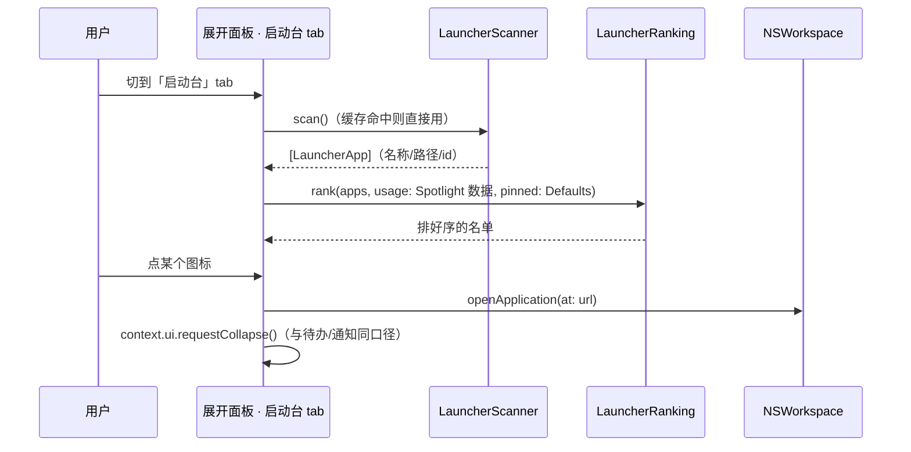

# 启动台 / 快捷启动（Launcher 模块）

| 项 | 值 |
|---|---|
| 状态 | 草稿 |
| 设计分级 | **档 2 · 标准**（新增一个内置模块：新的数据来源「扫 App 目录」、新的持久化键 `pinnedApps` 等、新的展开面板 surface；零私有 API） |
| 最后更新 | 2026-09-30 |
| 关联来源 | [16-nookx-reference.md](16-nookx-reference.md) §4.2 A 组第 4 行（Nook X 的"快捷启动 = 2×2 应用图标网格"）与 §4.1 的**失实更正**（该行曾被误写成"已对齐"）；[14](14-module-manifests.md) §1 的 `com.cmeng.gourd.launcher` 行；[15](15-platform-dependencies.md)（零私有 API）；[18](18-p1-todos-and-order.md)（同批次风格的模块落地范式） |
| 讨论入口 | 本仓库会话 |
| 读者与分界 | §背景与目标 / §明确不做 / §备选与取舍 给人读；§接口与数据形状 / §改动点设计 给执行者；§已知限制 / §实际交付 给后来人 |
| 本文件同时作为工作流 `p2-launcher`（2026-09-30）的设计记录 | |

> **怎么读**：判断依据在 §背景与目标、§明确不做、§备选与取舍；§接口与数据形状与 §改动点设计 供执行者查考；§已知限制、§实际交付、§决策摘要 留给后来人。

---

## 一句话方案

新增内置模块 **`com.cmeng.gourd.launcher`**：扫描本机应用目录（`/Applications`、`~/Applications`、`/System/Applications`）建立应用清单，用 Spotlight 的**使用数据**（最近使用时间 / 使用次数）排序，在展开面板里给出一屏**应用网格**（可搜索、可固定、点一下启动）；折叠态暂不占用槽位（左右槽位未落地，见 D-03）。

---

## 背景与目标

**问题现状**：① 用户在社区对照里看到 Nook X 的"快捷启动"（2×2 应用图标网格），问我们有没有——`docs/16` §4.1 曾**失实地**把它写成"已经对齐"，2026-09-29 的逐行审计已更正并移入 §4.2，但**功能本身仍然不存在**（`launcher` / `pinnedApps` / `recentApps` / `launchpad` 全仓 0 命中）。② 刘海面板目前没有"一键到常用 App"的入口，而这是 Nook X 首页上占据一整块的能力。

**为什么是现在**：模块系统（manifest / `ModuleRegistry` / 展开 tab / 组件开关）已经跑通，`launcher` 是 `docs/14` 里**零私有 API** 的模块之一（只需扫目录 + `NSWorkspace.open`），落地成本最低；同时它是用户点名下一条要做的功能。

**承接关系**：本批是 `docs/14` T-1/T-12 里 `launcher` 行的落地；**不**改 `docs/17`/`docs/18` 的首页结构（本批不占首页块，见 §明确不做）。

**目标与可衡量指标**：

| 目标项 | 描述 | 可衡量指标 |
|---|---|---|
| 能列出本机应用 | 扫三个应用目录，得到去重后的应用清单（显示名 + 路径 + 图标） | 单元测试（固定目录树 fixture：去重、跳过 `.app` 内的嵌套包、重名处理） |
| 排序符合直觉 | 固定（用户置顶）→ 最近使用 → 使用次数 → 名称 | 单元测试（纯函数，含"无 Spotlight 数据"的回落） |
| 能一键启动 | 点图标启动对应 App 并收起面板 | 目视 + 复用既有 `NSWorkspace.openApplication` |
| 可搜索、可固定 | 输入即过滤；右键固定/取消固定并持久化 | 单元测试（过滤纯函数）+ 目视（**2026-10-01 指针：两区布局与拖拽见 [docs/31](31-home-workday-launcher.md)**；搜索只过滤下区） |

**关键约束**：不新增权限（扫目录与启动 App 都不需要 TCC）；不引入私有 API（`docs/15` 已登记为零私有 API）；不新增网络请求。

---

## 做法

**机制一 · 应用清单来自目录扫描，不来自 LaunchServices 数据库**。扫 `/Applications`、`~/Applications`、`/System/Applications` 的一层子目录，取 `.app`（跳过 `.app` 内部的嵌套包、跳过不可执行的空壳），显示名优先 `CFBundleDisplayName` → `CFBundleName` → 文件名；图标用 `NSWorkspace.shared.icon(forFile:)`（只在渲染时取，扫描阶段不碰图标，避免几十次 I/O）。

**机制二 · 排序用 Spotlight 的使用数据**。`NSMetadataQuery` 在应用目录上取 `kMDItemLastUsedDate` / `kMDItemUseCount`；排序键 = `(是否固定, 最近使用时间, 使用次数, 名称)`（固定优先，其余降序）。**没有 Spotlight 数据时一律按名称排**——不能因为查询失败就让清单空掉或乱序。

**机制三 · 一个展开 tab，不占首页块**。模块声明 `surfaces: [.expanded]`（**不声明 `compact`**：折叠态左右槽位尚未落地，"占中央槽"会与待办抢位置；`docs/14` 里原本写的 `right/order 30` 槽位留到左右槽位落地后再声明）。tab 内容 = ~~搜索框 + 应用网格~~ **2026-10-01 改判：固定项上移「快捷启动」区、下区网格不再含它；新增拖拽语义 = 拖上固定 / 拖下取消（docs/31 §做法 机制三）**（p7 起 = 搜索框 + 上区「快捷启动」（固定项网格，空时一枚虚线提示格）+ 细分隔线 + 下区网格；上区顺序 = 固定先后、不受搜索影响）。

**机制四 · 固定项是用户数据，落 `Defaults`**。`pinnedApps: [String]`（存 bundle id 或路径——见 §接口与数据形状 2 的取值与理由）。

---

## 处理链路

以"打开启动台并启动一个应用"为例：



> 从这张图该读出什么：扫描与排序都在**渲染前一次性完成**，点图标只做启动 + 收起；没有常驻轮询，也没有跨模块依赖。

链路上的落点：扫描（§接口与数据形状 1）、排序（2）、启动与收起（§改动点设计 2）。

## 模块划分与依赖

| 单元 | 负责 | 不负责 |
|---|---|---|
| `LauncherAppScanner`（新） | 扫目录、解析名称/id、去重 | 不知道排序、不知道 UI |
| `LauncherRanking`（新，纯函数） | 排序与过滤（搜索） | 不读 Defaults、不碰文件系统 |
| `LauncherModule.swift`（新） | manifest、展开面板 UI、点击启动、固定/取消 | 不改内核、不占首页块 |
| `ModuleRegistry` / `HomeStripView` | —（**本批零改动**） | — |

**依赖方向**：`LauncherModule → Scanner / Ranking`；内核与首页不反向依赖它。**模块之间零依赖**（06 §3.3 R4）。

## 状态机与流程

无（扫描是一次性、启动是无状态动作）。**并发与幂等**：`scan()` 结果在模块内缓存（首次进 tab 时扫一次）；点图标重复触发时 `NSWorkspace.openApplication` 本身幂等（已启动则激活）；固定/取消固定是幂等的写键操作。

## 横切关注点

| 关注点 | 结论 |
|---|---|
| 性能 | 扫描是一次目录列举（三目录约几百个条目，忽略 `.app` 内部）；Spotlight 查询是异步的，超时/失败按"无使用数据"回落；图标按需取并在内存里缓存 |
| 可观测性 | 扫描结果条数与耗时记一条 `module.launcher` 日志；Spotlight 查询失败记 warning（含回落说明） |
| 安全 | **无（理由）**：读的是公开应用目录、用的是 `NSWorkspace` 的启动接口；不新增权限、不出站 |
| 成本 | 无 |

## 兼容迁移与回滚

| 维度 | 既有行为 | 本批之后 |
|---|---|---|
| 展开面板 tab | 现有 tab 不变 | 多一个「启动台」tab（关闭模块即消失） |
| 首页 / 折叠态 | 既有契约 | **不变**（本批不占首页块、不占折叠槽位） |
| 持久化 | 既有键 | 新增 `pinnedApps`（缺键 = 空表 = 无固定项） |

**回滚**：`git revert` 本批提交；`pinnedApps` 残留无消费者。

## 实际交付

**已交付**（工作流 `p2-launcher`，2026-09-30；提交 `71c5d0d1`、`f486eaa1`、`e7b505e5`）。

**代码**：`Modules/Launcher/LauncherAppScanner.swift`（新；`LauncherApp` / `scan(rootURLs:fileManager:)` / `defaultRoots`，扫描输出按路径升序保证确定性）、`Modules/Launcher/LauncherRanking.swift`（新；`LauncherUsage` / `rank(_:pinned:usage:)` / `filter(_:query:)` 纯函数）、`Modules/Launcher/LauncherModule.swift`（新；manifest 只声明 `.expanded`、`defaultEnabled = false`、`permissions = []`、config `iconSize`/`density`/`showRecents`；tab = 搜索框 + 自适应网格；`LauncherAppOpener` 注入点；`LauncherUsageQuery`；固定/取消固定）、`Kernel/KernelBootstrap.swift`（+1 行）、`models/Constants.swift`（+`pinnedApps`）、`Localizable.xcstrings`（`module.launcher.*` 8 条）。

**测试**：新增 31 条（T1 17 / T2 12 / T2 修复 2），全量 **284 条 0 失败**；其中两条经**变异验证**（删掉 `collapse()` → 收起用例红；`kMDItemUseCount` 打错 → 属性名用例红）。原始日志 `.workflow/p2-launcher/reports/t2-tests.log`。

**文档**：本文 + `docs/09` §5.1 与展开面板 tab 行、`docs/14` launcher 行（`surfaces` 收敛为只 `expanded`）、`docs/16` §4.2 6.1（规划中 → 已落地）、`docs/12`。

**与计划的偏离及原因**：① 扫描输出按路径升序（枚举顺序不稳，加确定性；规格只要求去重）；② `.app` 扩展名大小写不敏感；③ 空/纯空白 plist 值当缺键继续回落；④ 四项排序键全等时追加 `id` 定序（避免不稳定排序）；⑤ 两个结构体加 `Sendable`；⑥ 固定项的写盘做了"表不变不写"的幂等短路。

**遗留**：**真人目视未做**（本机长时间锁屏，只有离屏渲染证据：真扫 107 个应用 / 129 条使用数据 / 真图标）；"悬停展开 → 手点图标 / 右键固定"待用户确认；Spotlight 未索引的主机上"最近使用"整体回落成按名称（§已知限制 2）；符号链接与"同 bundle id 出现在两个路径"的定序未定义（畸形输入）。

## 已知限制

1. **只扫三个目录的一层**：不在 `/Applications` 子目录里的应用（例如 `~/Applications/Setapp/...` 这类两级目录）、以及用户自己放在别处的 `.app` 不会被列出。
2. **"最近使用"依赖 Spotlight**：`kMDItemLastUsedDate` / `kMDItemUseCount` 由 Spotlight 维护，未开 Spotlight 索引或元数据缺失时会整体回落成按名称排序（不报错、不空列表）。
3. **不做拖拽排序 / 分组 / 文件夹**：只做搜索 + 固定。**2026-10-01 指针：拖拽 = 固定/取消固定 已于 p7 引入（拖上固定 / 拖下取消）；排序 / 分组仍不做——docs/31 §做法 机制三。**
4. **折叠态与首页都不出现**：`compact` surface 与本批无关（左右槽位未落地）。

**回写期补充（`p2-launcher`，2026-09-30）**：

8. **使用数据每次模块激活只取一次**：`hasLoadedUsage` 闸门（`LauncherModule.swift`）使 `showRecents` 从 false 改成 true 需要**关开一次模块**才生效（改 config 不会自动重取）。
9. **空壳包也会被列出**：扫描只按 `.app` 扩展名筛，不校验包是否可执行；名称回落链走到文件名。

## 验收标准

| 不变量 | 保证方式 | 怎么测 |
|---|---|---|
| 扫描去重且跳过嵌套包 | `scan(rootURLs:)` 接受注入的根目录（测试用 fixture 目录树） | 单元测试（含同名不同路径、`.app` 内的 `.app`、非 `.app` 目录） |
| 排序稳定且可解释 | 排序键 `(固定, 最近使用, 使用次数, 名称)`，纯函数 | 单元测试（四项各造数据；无使用数据时按名称） |
| 搜索过滤正确 | `filter(apps, query:)` 纯函数（大小写不敏感、匹配显示名与文件名） | 单元测试 |
| 固定项持久且幂等 | 写 `pinnedApps`（先落盘再刷新） | 单元测试（重复固定/取消不产生重复项） |
| 既有行为不变 | 本批不动内核/首页/折叠态 | 全量单测回归 + `git diff --name-only` 核对 |

**成功度量**：展开面板能列出本机应用并能一键启动；常用 App 排在前面（固定过的永远在前）。

## 备选与取舍

| 取舍 | 选定 | 备选与没选的理由 |
|---|---|---|
| 应用清单来源 | **目录扫描**（三个根、一层） | 读 LaunchServices 数据库 / 私有 API：`docs/15` 要维持"零私有 API"的登记，且私有格式会随系统改版失效 |
| 排序数据 | **Spotlight**（`kMDItemLastUsedDate` / `kMDItemUseCount`） | 自己记账（每次我们启动就 +1）：只能统计"我们从岛上启动过"的，用系统别处启动的学不到；作为**备选保留**，若实测 Spotlight 数据不可用再切 |
| 表面（surface） | **只声明 `expanded`** | 声明 `compact`：左右槽位未落地，会与待办抢中央槽位；声明 `home`：用户没要求，且首页已有一排块 |
| 固定项形态 | **`pinnedApps: [String]`（bundle id 优先）** | 存路径：App 移动后失效；存完整模型：要新表/新文件，超出"配置进 Defaults"的口径 |

## 明确不做

- **两级目录扫描**（`~/Applications/Setapp/…` 这类会漏，见 §已知限制 1）
- **拖拽排序 / 分组 / 文件夹 / 卸载 / 重命名**：只做搜索 + 固定。**2026-10-01 指针：拖拽 = 固定/取消固定 已于 p7 引入（拖上固定 / 拖下取消）；排序 / 分组仍不做——docs/31 §做法 机制三。**
- **自己维护使用统计**（先用 Spotlight，见上表）
- **占折叠态槽位或首页块**（D-02；等左右槽位落地再补 `compact` + `slot: right`）
- **应用内搜索/打开文件**（那是 Spotlight 与 Launcher 的分工边界）
- **快捷指令（Shortcuts）模块**：那是另一个模块（`com.cmeng.gourd.shortcuts`，`docs/14` P2b 第 3、capability `shortcuts:run`），不在本批

## 接口与数据形状

### 1. 扫描（新文件）

```swift
// DynamicIsland/Modules/Launcher/LauncherAppScanner.swift
struct LauncherApp: Identifiable, Equatable {
    let id: String          // bundleIdentifier ?? 绝对路径（无 id 的 .app 也允许存在）
    let name: String        // CFBundleDisplayName → CFBundleName → 文件名（去 .app）
    let url: URL            // .app 的绝对路径
}

enum LauncherAppScanner {
    /// 扫一层子目录里的 .app；返回按 url 去重（同 url 只留一次）
    static func scan(rootURLs: [URL], fileManager: FileManager = .default) -> [LauncherApp]
    /// 默认根目录：/Applications、~/Applications、/System/Applications
    static var defaultRoots: [URL] { get }
}
```

### 2. 排序与过滤（新文件，纯函数）

```swift
// DynamicIsland/Modules/Launcher/LauncherRanking.swift
struct LauncherUsage: Equatable {          // 来自 Spotlight（可能全是 nil）
    let lastUsed: Date?
    let useCount: Int?
}

enum LauncherRanking {
    /// 固定优先 → 最近使用降序 → 使用次数降序 → 名称升序（本地化比较）
    static func rank(_ apps: [LauncherApp], pinned: [String],
                     usage: [String: LauncherUsage]) -> [LauncherApp]
    /// 搜索：大小写不敏感，匹配显示名或文件名
    static func filter(_ apps: [LauncherApp], query: String) -> [LauncherApp]
}
```

### 3. 持久化

```swift
// DynamicIsland/models/Constants.swift（// MARK: Module Kernel (P1) 段）
/// 启动台固定项：存 **bundleIdentifier 优先、无 id 时存绝对路径**。
/// 缺键 = 没有固定项（不是"未表达"——空表与无固定项语义相同）。
static let pinnedApps = Key<[String]>("pinnedApps", default: [])
```

### 4. 模块与 manifest

```swift
// DynamicIsland/Modules/Launcher/LauncherModule.swift
// id: com.cmeng.gourd.launcher
// name: LocalizedText(key: "module.launcher.name")   summary: "module.launcher.summary"
// icon: IconSpec(type: "symbol", name: "square.grid.2x2")
// version: "1.0.0"   apiVersion: HostInfo.currentAPIVersion   kind: "builtin"
// surfaces: [.expanded]                              ← 本批不声明 compact（见 D-03）
// defaultEnabled: false                              ← 新增模块一律默认关（docs/14 T-12）
// permissions: []                                    ← 零权限
// config: {"type":"object","properties":{"iconSize":…,"density":…,"showRecents":…}}
// config 语义（回写校正）：iconSize = 格子目标宽、density = 间距倍率，越界值**静默夹取**；
// showRecents 只在本模块激活时读一次（见 §已知限制 8）
```

### 改动点设计

| # | 改动点 | 终态 | 落点 | 关键实现约束 | 陷阱 |
|---|---|---|---|---|---|
| 1 | 扫描器 | 三目录一层、去重、名称三级回落 | `Modules/Launcher/LauncherAppScanner.swift`（新） | 根目录**必须可注入**（测试用 fixture）；`.app` 内的嵌套 `.app` 不算；符号链接不递归 | 直接扫 `~/Applications` 可能在未授权时报错——用 `try?` 逐目录容错，别让一个目录失败整表为空 |
| 2 | tab UI | 搜索框 + 网格（图标 + 名称），点图标启动并收起 | `LauncherModule.swift` | 启动用 `NSWorkspace.shared.openApplication(at:configuration:)`（`configuration.activates = true`）；收起用 `context.ui.requestCollapse()`（与待办/通知同口径）；图标按需取 + 缓存 | 不要在主线程同步取几百个图标（按可见项惰性取） |
| 3 | 固定 | 右键菜单固定/取消固定 | 同上 | 写 `pinnedApps`（先落盘再刷新）；键 = `bundleIdentifier ?? path` | 同一 App 用两种键写两次 → 固定判据必须统一走 `LauncherApp.id` |
| 4 | 排序接入 | `rank` 在渲染前跑一次 | 同上 | Spotlight 查询异步：**先按名称渲染，查询回来再重排**（不阻塞首屏） | 查询失败不能把固定项也丢了（固定优先是本地数据） |

---

## 决策摘要

| ID | 决策 | 来源 | 理由 |
|----|------|------|------|
| D-01 | 应用清单来自**目录扫描 + Spotlight 使用数据**，不引入 LaunchServices 私有库 | agent | `docs/15` 已把它登记为**零私有 API**；扫目录 + `kMDItem*` 是公开面。代价：单层扫描、未覆盖的目录里的 App 不出现（§已知限制 1） |
| D-02 | 本批只声明 `expanded`（**不声明 `compact`**），也不占首页块 | agent | 折叠态左右槽位未落地（`p2-todos-facelift` D-04）；声明 `compact` 会与待办抢中央槽位，声明 `home` 会让首页再多一块而用户没要求。等左右槽位落地时再补 `compact` + `slot: right` |
| D-03 | 固定项用 `pinnedApps: [String]`（bundle id 优先、无 id 存路径） | agent | 用户数据最小可用形态；不引入新模型、不写文件（与内核"配置进 Defaults"的口径一致） |
| D-04 | 新增模块 `defaultEnabled = false` | agent | 沿用 `docs/14` T-12 的口径：新增模块一律默认关（用户显式开启），避免"装了自动上屏" |
| D-05 | Spotlight 查询必须**跑在主线程的 run loop 上**（类型级 `@MainActor` + "先见 `isGathering=true` 再见 `false`" 判据） | agent | 执行期实测真缺陷：原来写成 `nonisolated` + `await`，落到协作线程池后 `NSMetadataQuery` **永远收集不完**（0 条 / 6.05s）→"最近使用"静默失效；修后 129 条 / 0.079s。代价：查询期间占主线程（实测 <0.1s，可接受） |
| D-06 | "启动 → 收起"与"属性映射"两组列为**必测**，并用变异验证（删 `collapse()` / 打错 `kMDItemUseCount` 必须让用例变红） | agent | 复审指出的两条测试缺口恰好都是"静默失效型"：不测就永远是绿的，而用户看不到"最近使用"排序 |
| D-07 | 排序键全等时追加 `id` 定序；扫描输出按路径升序 | agent | 枚举顺序与相等元素的相对顺序在 Swift 里都不保证，加确定性避免"每次打开顺序都变" |

---

## 附录：改动索引

| 类别 | 文件 | 动作 |
|---|---|---|
| 模块 | `DynamicIsland/Modules/Launcher/LauncherAppScanner.swift`（新） | 目录扫描 |
| 模块 | `DynamicIsland/Modules/Launcher/LauncherRanking.swift`（新） | 排序 / 过滤纯函数 |
| 模块 | `DynamicIsland/Modules/Launcher/LauncherModule.swift`（新） | manifest + tab UI + 启动 + 固定 |
| 内核 | `DynamicIsland/Kernel/KernelBootstrap.swift` | `builtinModules` 加一项 |
| 配置 | `DynamicIsland/models/Constants.swift` | 加 `pinnedApps` |
| 本地化 | `DynamicIsland/Localizable.xcstrings` | `module.launcher.*` 文案 |
| 测试 | `DynamicIslandTests/ModuleKernelTests.swift` | 扫描 / 排序 / 过滤 / 固定 四组 |
| 文档 | `docs/09` §5.1、`docs/14` §1 launcher 行、`docs/16` §4.2（6.1 状态）、`docs/12` | 回写 |
