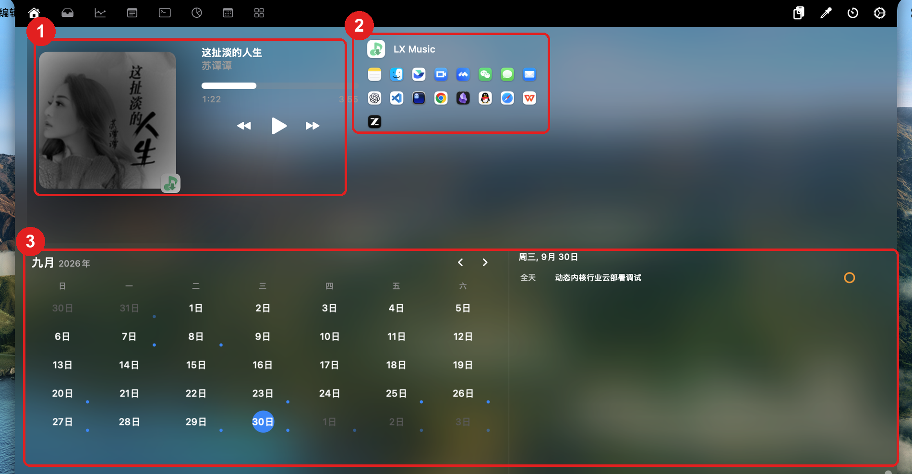
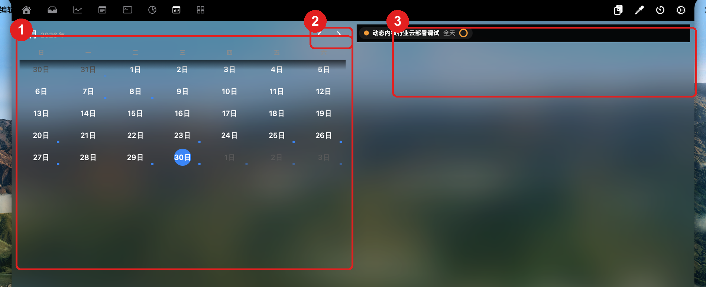
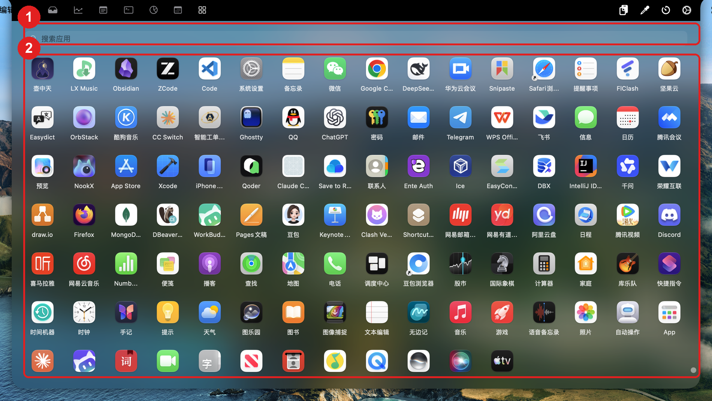
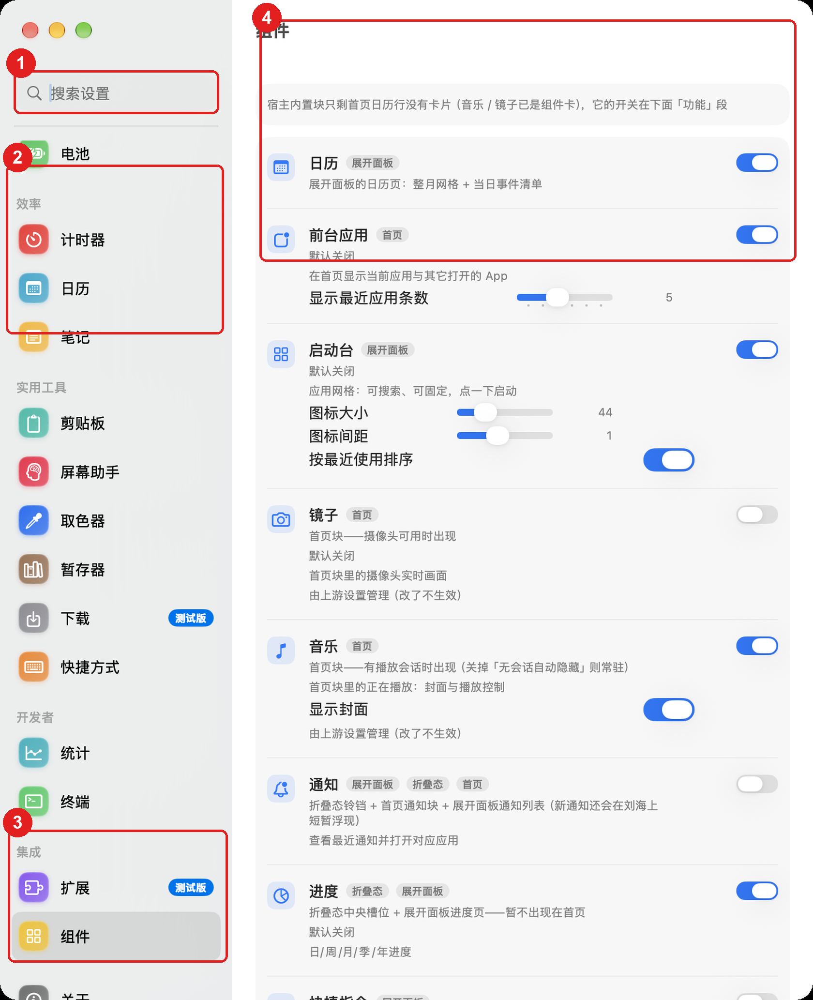
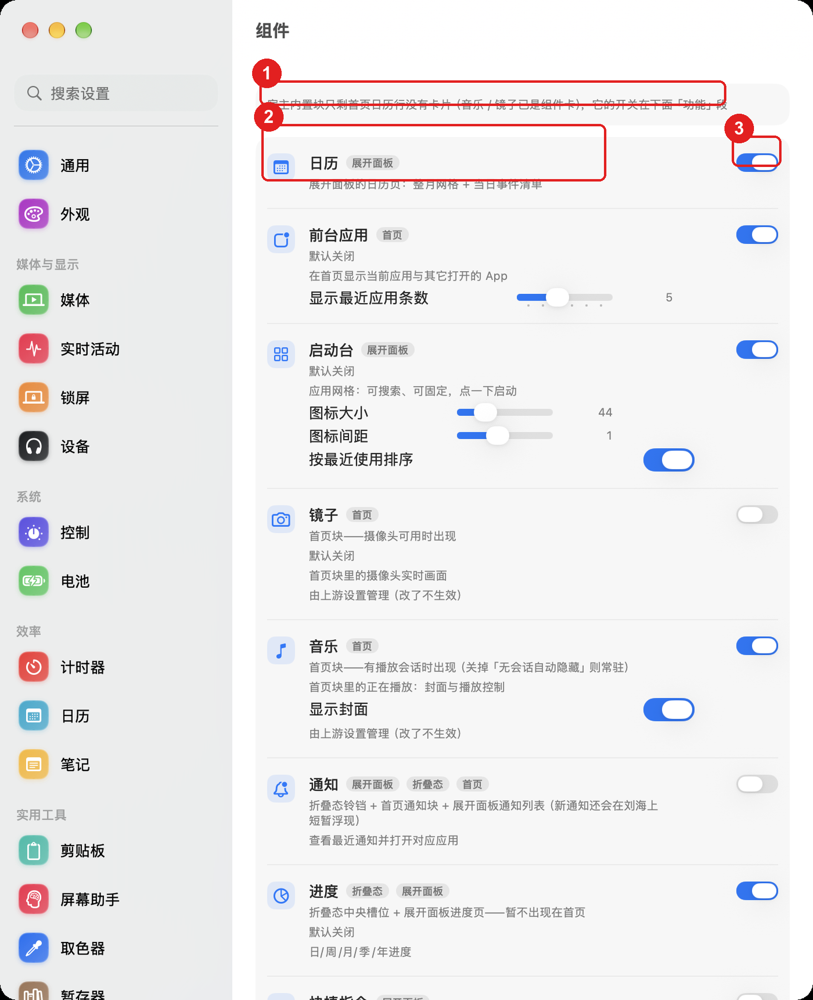
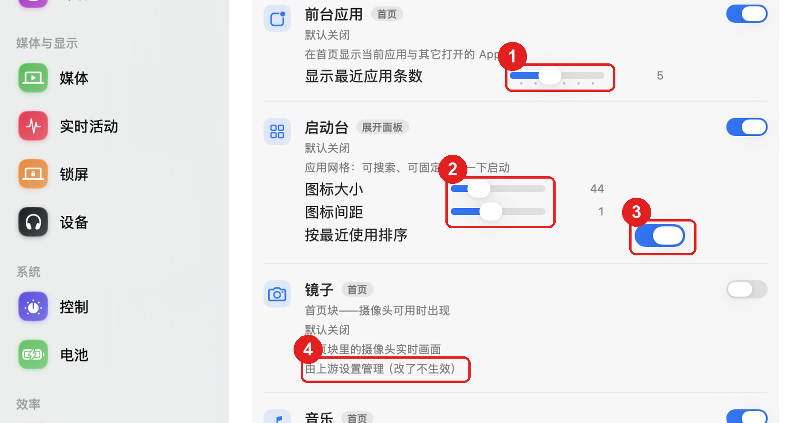

# 壶中天 · 用户手册

| 项 | 值 |
|---|---|
| 适用版本 | **0.1.0**（2026-09-30 冻结；版本号来源 `VERSION` / `Info.plist`） |
| 适用系统 | macOS 26（Tahoe）；应用是菜单栏小工具（`LSUIElement`，没有 Dock 图标） |
| 图例 | 本目录 `assets/` 下 7 张实机截图，宽 1600–2000px；红圈序号与图下的「① ② ③」逐条对应 |
| 不适用 | 想在原版 Atoll 上照做的——本项目改了名字与若干默认值，见 [../24-release-freeze.md](../24-release-freeze.md) |

> **这份文件回答「装好之后怎么用」**。每个功能的设计口径与取舍在 `docs/` 里（[09 功能与机制](../09-features-and-mechanisms.md)、[20 组件页](../20-component-page.md)~[23 首页适配](../23-home-fit.md)），发布前的自检清单在 [../25-release-smoke.md](../25-release-smoke.md)（**给发布者，不是给使用者**）。

## 1. 第一次打开

### 1.1 装

1. 产物二选一：`sh tools/build.sh --install`（直接装到 `/Applications/壶中天.app`），或 `sh tools/build.sh --dmg` 后打开 `dist/壶中天-0.1.0.dmg`，把「壶中天」拖进「应用程序」。
2. 第一次双击可能被 Gatekeeper 拦下（应用未公证）：右键 → **打开**，或到「系统设置 → 隐私与安全性」点「仍要打开」。
3. 首次启动会弹一个引导窗（语言 → 相机 / 日历 / 音乐授权 → 使用档位），走完即可；之后它不再出现。

### 1.2 权限清单（缺哪个，哪条功能就降级——不会崩）

| 权限 | 谁在用 | 什么时候问 |
|---|---|---|
| 日历、提醒事项 | 首页日历行、展开面板的「日历」tab（待办模块读的是提醒事项） | 首次读日历 / 待办时 |
| 摄像头 | 首页「镜子」块 | 「镜子」块开着时 |
| 通知 | 计时器到点提醒、通知相关浮层 | 首次需要发通知时 |
| 完全磁盘访问 | **通知模块**读系统通知库（没有它时通知块显示不可读提示，属正常降级） | 手动到「系统设置 → 隐私与安全性 → 完全磁盘访问」勾选 |
| 辅助功能 | 通知的「同时关掉系统通知」（AX 真关）、媒体键 / 亮度键拦截 | 用到时按提示给 |
| 定位 | 锁屏天气 widget | 首次显示天气时 |
| 本地网络 | 文件暂存（暂存器）的局域网传输 | 用到时按提示给 |

### 1.3 首启看到什么

① **刘海处的一小块**（收起态）：不占地方，鼠标移上去才展开；没有刘海的机型上它是一枚居中的虚拟胶囊。
② **菜单栏图标**：右侧那排小图标（网速、电池、时钟等）由各自开关控制，可以在设置里关掉。

## 2. 首页有什么

① **媒体块**：正在播放的封面 / 曲名 / 进度 / 上一首·播放·下一首；暂停且开了「自动隐藏」时整块消失。
② **前台应用块**：上半是当前前台应用，下半是最近切换过的几个（点一下切回去）。
③ **首页日历行**：条下面整宽的月历 + 当天清单（**没有**上下两条渐变遮罩），翻月有箭头。

- **折叠态 / 展开态**：收起时只剩刘海（或虚拟胶囊）与菜单栏；鼠标移到屏幕顶部中间 → 面板展开；鼠标移开（或按 `⌘⇧I`）收起。
- **tab 栏**：展开面板顶部左到右分别是 主页 / 收件箱（文件暂存）/ 统计 / 备注 / 终端 / 调色盘 / 日历 / 启动台（模块 tab 排在最后一段），右侧是 剪贴板 / 取色 / 计时器 / 设置（齿轮）。
- **块放不下会明说**：面板窄时首页条按顺序从尾部丢块，条尾给一个 `＋N`（**拉宽面板**是唯一办法，提示里没有别的入口）。

## 3. 每个模块做什么

四组。**「默认关」的模块要自己打开**：设置 → 组件里拨开关（或到对应上游设置页），拨完即时生效、不用重启。

### 3.1 媒体

- **音乐**（默认开）：首页条的音乐块，见上图 ①。开关真源是上游的「显示标准媒体控件」——组件页与上游设置页拨的是同一个开关。
- **封面显示**：组件页 → 音乐卡 →「显示封面」；关掉后仍显示曲名与操作，只不画封面。
- **歌词**（默认关）：随播放逐行显示，走 LRCLIB 与本地缓存；打开方式是上游的「歌词」开关。

### 3.2 系统指标

- **统计**（默认开）：展开面板「统计」tab 一张表，CPU / 内存 / 网络 / 磁盘 / GPU / 温度按设定间隔刷新。
- **电池**：菜单栏电池图标与百分比、充放电 HUD；低电量提醒阈值在设置 → 电池。
- **控制（HUD）**：调音量 / 亮度 / 键盘背光时，刘海处直接显示 HUD，不弹系统浮层；可在设置 → 控制里逐项开关。

### 3.3 效率

- **剪贴板**（默认开）：剪贴板历史 + 固定片段。右侧「剪贴板」按钮或 `⌘⇧C` 打开；显示形态（面板 / 刘海 tab）在设置 → 剪贴板。
- **计时器**（默认开）：展开面板的计时器 tab 或右侧计时器按钮；预设 + 自定义倒计时，暂停 / 停止都在面板内，收起面板后计时继续跑。
- **日历**（默认开）：**两处呈现、同一个开关** `showCalendar`——首页那条日历行（图 ③）与下面这个展开 tab；关掉行，tab 也一起没。

① **月历网格**：整月 + 有事件的日期打点，今天高亮；② **翻月箭头**；③ **当日清单**：当天日程（全天项标「全天」）。

- **待办**（默认开，占折叠态中央槽位）：顶部三环「今日 / 本周 / 所有」是筛选器，下面是对应清单；**写的是系统提醒事项**（新增 / 完成 / 删除都会同步过去）。

### 3.4 自建（本项目新增）

- **快捷启动（启动台）**（默认关）：可搜索、可固定的应用网格，点图标启动；右键固定 / 取消固定。
- **农历**（默认关）：折叠态左侧的农历日期，格式与节日标记可配。
- **进度**（默认关）：日 / 周 / 月 / 季 / 年的剩余量清单；**默认关**，要自己打开。
- **快捷指令**（默认关）：把系统「快捷指令」搬进展开面板——搜索、固定、运行，输出可回显；超时与并发有闸门。
- **通知**（默认开）：首页「最近 N 条」+ 展开面板通知列表 + 新通知在刘海上的浮层；点条目打开对应 App。
- **终端**（默认关）：设置 → 终端里把内置终端换成外部 App（如 Ghostty）；`⌃` + 反引号键直接开终端 tab。
- **前台应用**（默认关）：首页条的前台块（图 ②），「显示最近应用条数」可在组件页拨。

① **搜索框**：输入即过滤（名字 / 拼音首字母）；② **应用网格**：点一下启动并自动收起面板。

## 4. 设置页怎么用

① **搜索设置**：输入关键词直接跳到对应页（例如输入「组件」）；② **侧栏按用途分组**，组内每一项是一个 tab（这里能看到「效率」组：计时器 / 日历 / 笔记）；③ **「集成」组**里是「扩展」与「组件」；④ **右侧 = 当前选中页的内容**。

| 分组 | tab | 一句话 |
|---|---|---|
| 核心 | 通用 / 外观 | 界面模式、登录时启动、显示在哪块屏 / 材质、圆角、强调色 |
| 媒体与显示 | 媒体 / 实时活动 / 锁屏 / 设备 | 播放器与封面 / 上岛的活动（音量·通知·计时器）/ 锁屏 widget / 蓝牙音频设备 |
| 系统 | 控制 / 电池 | 音量·亮度·背光 HUD 与媒体键 / 电池指示与低电量提醒 |
| 效率 | 计时器 / 日历 / 笔记 | 计时器预设与显示形态 / 日历与提醒的读取口径 / 便签 |
| 实用工具 | 剪贴板 / 屏幕助手 / 取色器 / 暂存器 / 下载 / 快捷方式 | 剪贴板历史 / 屏幕助手（默认关）/ 取色面板 / 文件暂存 / 下载面板 / **全局快捷键在这里改** |
| 开发者 | 统计 / 终端 | 系统指标开关与刷新间隔 / 终端 tab 与外部终端 App |
| 集成 | 扩展 / 组件 | 上游扩展通道 / **组件页——本项目的模块总控台** |
| | 关于 | 版本、更新检查、日志导出 |

**组件页**是所有模块的总控台：一个模块一张卡，卡上写着「默认开 / 默认关」「开了会在哪看到什么」（首页 / 折叠态 / 展开面板徽标），右边的开关就是它的启用开关。

① **顶部提示行**：首页内置块里只剩日历行没有卡片，它的开关在下面的「功能」段；② **模块卡**（一个模块一张，含徽标与说明行）；③ **启用开关**——与上游设置页里同名的那一项是**同一个**开关。

在卡片上还能直接拨部分配置：① **整数滑杆**（前台应用 · 显示最近应用条数）；② **数值滑杆**（启动台 · 图标大小 / 图标间距）；③ **布尔开关**（启动台 · 按最近使用排序）；④ 灰字「**由上游设置管理（改了不生效）**」——这一项的真源还在上游设置页，请到那里改（写路径接管是后续批次）。

## 5. 快捷键

| 动作 | 默认键 | 在哪改 |
|---|---|---|
| 展开 / 收起面板 | `⌘⇧I` | 设置 → 快捷方式 |
| 提示浮层（音量 / 播放信息的 Sneak Peek） | `⌘⇧H` | 设置 → 快捷方式 |
| 剪贴板历史面板 | `⌘⇧C` | 设置 → 快捷方式 |
| 取色器面板 | `⌘⇧P` | 设置 → 快捷方式 |
| 屏幕助手浮层 | `⌘⇧A`（**默认关**，见 §1.3） | 设置 → 快捷方式 |
| 终端 tab | `⌃` + 反引号键 | 设置 → 快捷方式 |
| 降低 / 提高键盘背光 | `⌘F1` / `⌘F2` | 设置 → 快捷方式 |
| 演示计时器 | `⌘⇧T` | 设置 → 快捷方式 |

- 全部快捷键可在 设置 → 快捷方式 里改或清空；顶部还有一个总开关（关掉后全部快捷键失效，界面按钮仍可用）。
- 默认键的**唯一来源**是代码：`DynamicIsland/Shortcuts/ShortcutConstants.swift`（改默认值要改那里）。

## 6. 常见问题

| 症状 | 原因 | 处置 |
|---|---|---|
| 首页条只显示 2 块，条尾有个 `＋N` | 面板宽度不够，按顺序从尾部丢块（`＋N` 就是「还有几块没显示」） | 拉宽面板，或关掉占位大的块（含媒体的四块约需面板 ≥892pt） |
| 某个模块开了却没反应 | 它的**渲染点**在别的开关上：接管模块的启用真源是上游键（如 `enableTimerFeature` / `showMirror` / `showStandardMediaControls`） | 在组件页看那张卡的说明行；标了「由上游设置管理」的就到上游设置页改 |
| 通知块显示「不可读」 | 缺**完全磁盘访问** | 系统设置 → 隐私与安全性 → 完全磁盘访问 勾选壶中天，重启应用 |
| 点通知的 × 只从岛上消失、系统通知还在 | 那条通知**没有 AX 句柄**（超过约 10 秒，或是数据库通道读到的）——文案会如实写「从列表移除」 | 想真关就趁通知刚弹出时点浮层的 ×（会显示「同时关掉系统通知」） |
| 快捷指令运行很久不结束 / 报超时 | 子进程超时是**软界**：超时只终止 `shortcuts` 本身，它拉起的动作不保证一起结束 | 关掉 `showOutput` 少等；超时秒数在组件页 → 快捷指令卡上调 |
| 为什么它要摄像头 / 完全磁盘访问这类权限 | 功能是「本地实现」的：媒体走私有框架 + 子进程、通知读本机数据库、镜子直接开摄像头——**没有出站请求**，也不上传任何东西 | 不需要的功能直接关掉，权限可以不给（对应功能会降级而不是崩） |
| 应用没有 Dock 图标，找不到它 | 它是菜单栏小工具（`LSUIElement`） | 点菜单栏图标，或按 `⌘⇧I` 展开面板；退出在菜单栏菜单里 |

> 界面上的 `＋N` 悬停列名、通知 × 的两档文案这类边界的完整清单，见 [21](../21-strip-honesty.md) 与 [23](../23-home-fit.md) 的「已知限制」。

## 7. 更新与卸载

**更新**：重新 `sh tools/build.sh --install`，或把新 DMG 里的「壶中天」拖进「应用程序」覆盖。偏好不会丢——授权按「证书 + Bundle ID」记忆，覆盖安装不会重复弹权限窗。

**卸载**：把 `/Applications/壶中天.app` 拖进废纸篓即可。想连痕迹一起清掉，再按需删这几处（**都是可选的**）：

| 位置 | 内容 |
|---|---|
| `~/Library/Preferences/com.cmeng.gourd.plist` | 主偏好（调试构建是 `com.cmeng.gourd.dev.plist`） |
| `~/Library/Preferences/com.cmeng.gourd.module.*.plist` | 各模块自己的配置域（启动台图标大小一类） |
| `~/Library/Logs/Gourd/` | 通知探针日志（排查用的那两份） |
| `~/Library/Caches/com.cmeng.gourd.dev/` | 调试构建的缓存 |
| 系统设置 → 通用 → 登录项 | 开了「登录时启动」会有一条 |
| 钥匙串访问 | 登录过 Spotify 一类第三方服务会留下一条令牌；删掉就要重新登录 |
